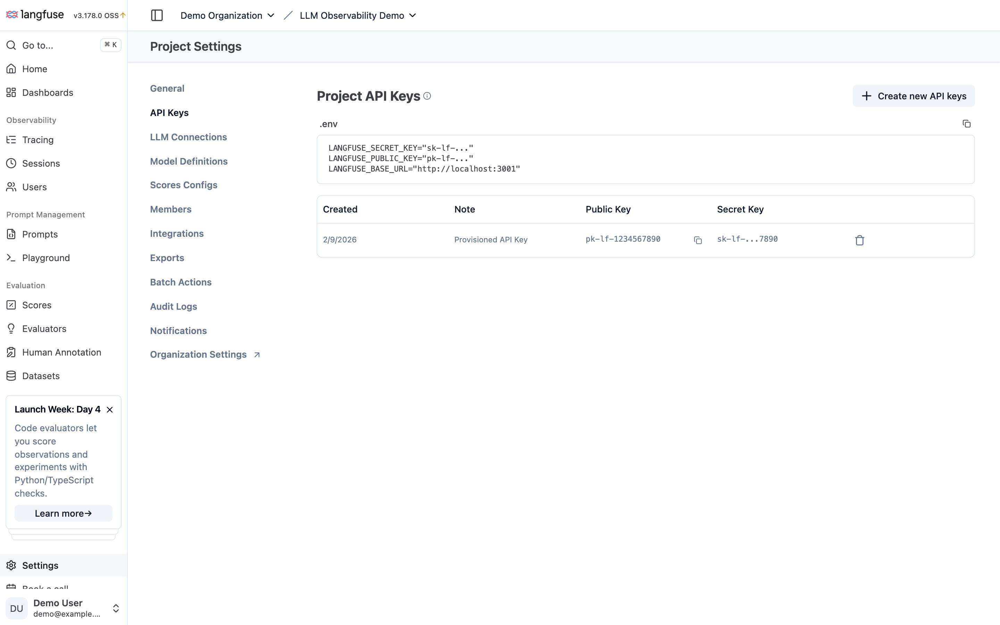
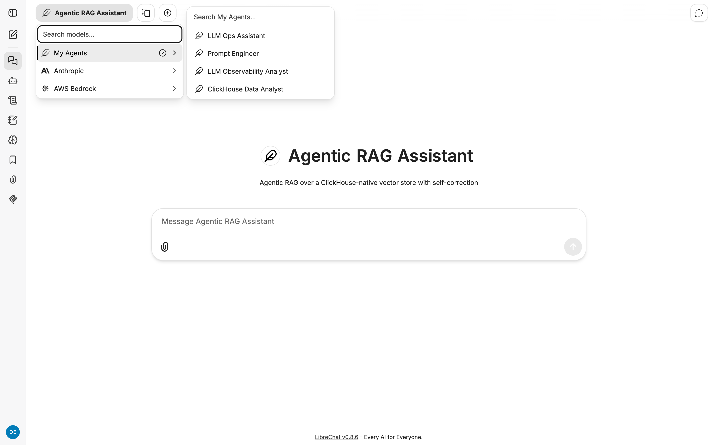
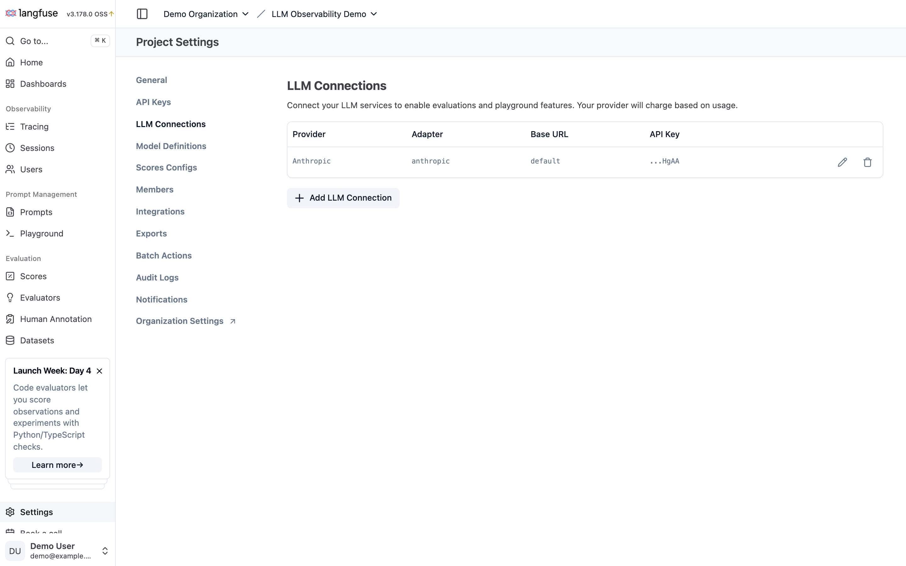
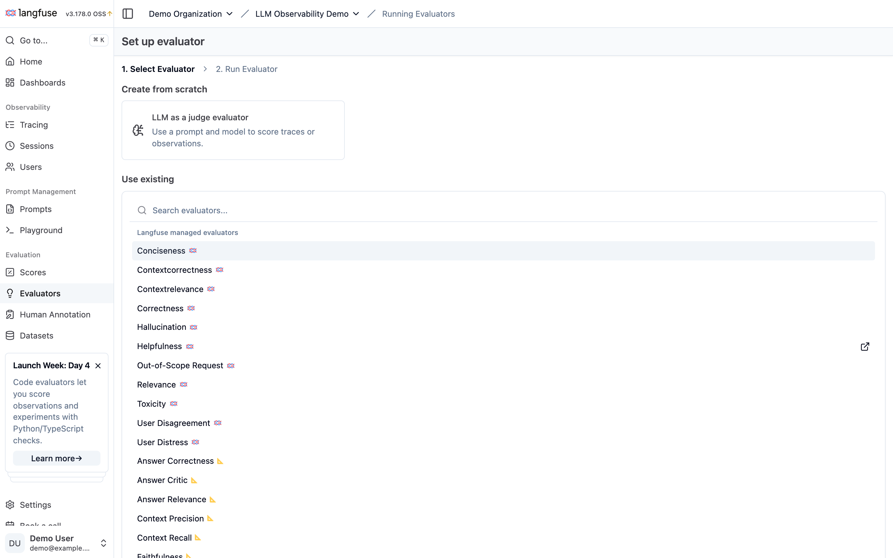

# LLM Observability with ClickHouse

**A complete, self-provisioning LLM observability stack — Langfuse on ClickHouse, real instrumented apps, automated evaluation — built to be deployed, presented, and learned from.**

| You want to… | Start here |
|--------------|------------|
| **Understand the AI Engineering loop** it demonstrates | [AI_ENGINEERING_LOOP.md](AI_ENGINEERING_LOOP.md) — trace → monitor → dataset → experiment → evaluate → **deploy** → repeat, mapped to every demo |
| **Deploy it** (~5 min, one secret) | `ANTHROPIC_API_KEY=sk-ant-... ./setup.sh --seed` — or the [Quickstart Guide](docs/QUICKSTART_GUIDE.md) |
| **Present it** to a customer or team | [SA Field Guide](docs/SA_FIELD_GUIDE.md) — demo selection, talk tracks, objection handling |
| **Learn from it** | [User Journey](docs/USER_JOURNEY.md) (hands-on, ~35 min) and the [Use Case Catalog](docs/USE_CASES.md) |
| **Point an AI agent at it** | Open any coding agent in the repo and say **"deploy this demo"** — [AGENTS.md](AGENTS.md) and the [bundled skills](#coding-agent-support) handle the rest |

> **Stack already running?** [Jump to Quick Start](#quick-start) to generate traces in 2 minutes.
> **All documentation**, indexed by persona: [docs/README.md](docs/README.md)

---

## The Challenge: Why LLM Applications Need Different Observability

Building LLM applications is easy. Knowing if they're working well in production is hard.

**The core problem:** Traditional monitoring tells you *if* your app responded, but not *if the response was good*. When your LLM confidently returns a wrong answer, your metrics show a successful request.

| Traditional Apps | LLM Applications |
|------------------|------------------|
| Deterministic outputs | Non-deterministic outputs |
| Errors are obvious (exceptions, 500s) | "Wrong" answers look like valid responses |
| Cost is predictable | Cost scales unpredictably with token usage |
| Debugging = stack traces | Debugging = understanding full prompt/completion context |

**You need to capture, store, and analyze every prompt/completion pair—plus quality evaluations that tell you whether the output was actually good.** This means:

- **Large payloads**: Full prompts and completions can be 10-100KB per request
- **High cardinality**: Every interaction is unique (user queries, context, responses)
- **Real-time queries**: Debugging a production issue means searching through thousands of traces *now*
- **Quality scoring**: Running LLM-as-judge evaluations on historical data

This is an analytics workload, not a transactional one. And that's where ClickHouse comes in.

---

## Why ClickHouse?

### What is ClickHouse?

[ClickHouse](https://clickhouse.com/) is an open-source columnar database designed for real-time analytics. Unlike row-based databases (PostgreSQL, MySQL) that excel at transactional workloads, ClickHouse is optimized for:
- Ingesting millions of events per second
- Running analytical queries across billions of rows in milliseconds
- Compressing data efficiently (often 10-20x smaller than row stores)

It's the database behind Cloudflare's analytics, Uber's logging infrastructure, and eBay's observability platform.

### Why ClickHouse for LLM Observability?

LLM observability data has specific characteristics that make ClickHouse an ideal fit:

| Characteristic | Why It Matters | How ClickHouse Helps |
|----------------|----------------|----------------------|
| **Large text payloads** | Prompts/completions are 10-100KB each | Columnar compression excels at repetitive text (system prompts, templates) |
| **Append-only writes** | Traces are written once, never updated | ClickHouse is optimized for append-only ingestion |
| **Analytical queries** | "Show me all slow responses for model X" | Sub-second queries across billions of rows |
| **Time-series patterns** | Debugging means querying recent data | Native time-series optimizations and partitioning |
| **High cardinality** | Every trace has unique content | Handles high-cardinality data without index bloat |

**The bottom line:** ClickHouse gives you the analytical power of a data warehouse with the real-time query performance needed for production debugging—using SQL you already know.

---

## The Value Proposition

With ClickHouse as your centralized observability backend (via Langfuse), you can:

1. **Instrument** - Automatically capture every LLM interaction via the Langfuse SDK
2. **Observe** - Search, filter, and visualize traces in real-time
3. **Monitor** - Track token usage, costs, and latency across all your LLM apps
4. **Evaluate** - Run LLM-as-judge quality assessments on production data

**One database. Complete visibility. Production-grade LLM observability.**

---

## Deployment Modes

This demo supports two deployment modes. **Cloud is recommended** for quick demos — it needs fewer containers and no local Langfuse stack.

| | Cloud | Self-Hosted |
|---|---|---|
| **Langfuse** | [Langfuse Cloud](https://cloud.langfuse.com) (free tier) | Docker (~7 containers) |
| **ClickHouse (Langfuse backend)** | Managed by Langfuse Cloud | Docker (local) |
| **Local containers** | ~5 (LibreChat, MongoDB, Meilisearch, Nginx, MCP) | ~12 (all of the above + Langfuse stack) |
| **Setup** | Set `DEPLOY_MODE=cloud` + Langfuse Cloud API keys | Default — just run `./setup.sh` |
| **Best for** | Quick demos, workshops, low-resource machines | Fully offline, air-gapped, or custom Langfuse config |

**Cloud quick start:**
```bash
# 1. Sign up at https://cloud.langfuse.com (free)
# 2. Create a project and copy your API keys from Settings > API Keys
# 3. Configure:
cp .env.example .env
# Edit .env: set DEPLOY_MODE=cloud, paste your keys
./setup.sh
```

The keys live in **Project Settings → API Keys** (same place in Langfuse Cloud and self-hosted — self-hosted provisions them automatically):



**Self-hosted quick start** (default):
```bash
./setup.sh    # Everything runs locally
```

---

## Quick Start

### Already Have the Stack Running?

**Just want to generate traces?** Run the demo scripts directly:

```bash
# Check if services are running
docker compose --profile langfuse ps

# Generate Text-to-SQL traces (3 demo queries)
docker compose run --rm text-to-sql python main.py

# Generate Vector RAG traces (3 demo queries)
docker compose run --rm vector-rag python main.py

# Send a request through LiteLLM and verify its Langfuse trace
./demos/litellm-gateway/run_demo.sh

# Run interactive mode (type your own questions)
docker compose run --rm text-to-sql python main.py --interactive
docker compose run --rm vector-rag python main.py --interactive
```

**View your traces:**
- **Langfuse**: http://localhost:3001 (LLM traces, evaluations, prompt playground)
  - Email: `demo@example.com` | Password: `demodemo1!`

**Time:** 2-3 minutes | **Outcome:** Fresh traces in Langfuse

---

### First Time Setup?

```bash
git clone https://github.com/doneyli/clickhouse-llm-observability.git
cd clickhouse-llm-observability
./setup.sh --seed
```

Or fully non-interactive (CI, scripts, coding agents):

```bash
ANTHROPIC_API_KEY=sk-ant-... ./setup.sh --seed
```

The setup script is **idempotent** — safe to re-run at any time. One run gives you a fully demo-ready stack:
- Creates `.env` from template (only if missing)
- Prompts for your Anthropic API key (only if not set — that's the only secret you need)
- Generates LibreChat secrets (only if missing)
- Auto-provisions Langfuse: demo org, project, login, and API keys (headless init)
- Configures the **Langfuse LLM connection** with the same Anthropic key, so the Playground and LLM-as-a-Judge evaluators work immediately
- Creates **5 pre-configured LibreChat agents** with MCP tools (see below)
- Starts all services, waits for health checks, and prints a demo-readiness checklist

When it finishes, open LibreChat at http://localhost:3080, log in as `demo@example.com` / `demodemo1!`, and pick an agent:



| Agent | What it does |
|-------|--------------|
| **ClickHouse Data Analyst** | SQL analysis over the public ClickHouse Playground (35+ datasets) |
| **LLM Observability Analyst** | Queries Langfuse trace data in ClickHouse (latency, cost, scores) |
| **Prompt Engineer** | Manages and iterates on prompts stored in Langfuse |
| **LLM Ops Assistant** | All of the above combined — full-stack LLM operations |
| **Agentic RAG Assistant** | Corrective RAG over a ClickHouse-native vector store + live SQL |

For more detail, see the [Guided User Journey](docs/USER_JOURNEY.md) or [Quickstart Guide](docs/QUICKSTART_GUIDE.md).

---

## Architecture

This solution integrates multiple open-source tools—all powered by ClickHouse:

```
┌──────────────────────────────────────────────────────────────────────────────┐
│                            YOUR LLM APPLICATIONS                              │
│                                                                              │
│   ┌─────────────┐     ┌─────────────┐     ┌─────────────┐                   │
│   │ Text-to-SQL │     │ Vector RAG  │     │  LibreChat  │                   │
│   │    Demo     │     │    Demo     │     │   (Chat)    │                   │
│   └──────┬──────┘     └──────┬──────┘     └──────┬──────┘                   │
│          │                   │                   │                          │
│     Langfuse SDK        Langfuse SDK       Langfuse (native)               │
│          │                   │                   │                          │
│          └───────────────────┼───────────────────┘                          │
│                              │                                              │
└──────────────────────────────┼──────────────────────────────────────────────┘
                               │
                               ▼
┌──────────────────────────────────────────────────────────────────────────────┐
│                            LANGFUSE                                          │
│                            localhost:3001                                     │
│                                                                              │
│   • Real-time LLM tracing       • Prompt playground                         │
│   • Score visualization          • LLM-as-judge evaluation                  │
│   • Cost tracking                • Session management                       │
│                                                                              │
│   Backend: ClickHouse (OLAP) + PostgreSQL (metadata) + Redis (cache)        │
└──────────────────────────────────────────────────────────────────────────────┘
```

### Components

| Component | What It Does | Langfuse Trace Name | Filter Tag |
|-----------|-------------|--------------------:|----------:|
| **Text-to-SQL** | Converts natural language to SQL and runs it against ClickHouse's public demo database (UK property, GitHub events, OpenSky flights) | `text-to-sql` | `text-to-sql` |
| **Vector RAG** | Retrieval-augmented generation — embeds documents with sentence-transformers, stores in ChromaDB, retrieves context for LLM answers | `vector-rag` | `vector-rag` |
| **LiteLLM Gateway** | OpenAI-compatible AI gateway that centrally exports model, token, cost, latency, session, and request data to Langfuse | `litellm-gateway-demo` | `litellm` |
| **LibreChat** | Full chat UI with native Langfuse tracing — use it like ChatGPT, every conversation is traced | `LibreChat` | `librechat` |
| **Test Scenarios** | Pre-crafted prompt/response pairs that intentionally fail in different ways — used to demo Langfuse evaluators | per-scenario name | `test-scenario` |
| **Langfuse** | The observability platform — stores traces in ClickHouse, provides UI for search, cost tracking, and LLM-as-a-Judge evaluation | — | — |

### Trace Tagging

Every trace source is tagged so you can filter in Langfuse:

| Tag | What It Captures |
|-----|-----------------|
| `text-to-sql` | Text-to-SQL demo queries |
| `vector-rag` | Vector RAG demo queries |
| `litellm` | Requests captured centrally by the LiteLLM gateway |
| `librechat` | LibreChat conversations |
| `demo` | All demo queries, including LiteLLM gateway requests |
| `test-scenario` | All test scenario traces |

### Test Scenarios

40 synthetic traces (10 per category) designed to demonstrate evaluation failure modes:

| IDs | Category | Tests For | Examples |
|-----|----------|-----------|---------|
| 1-10 | **Low Relevance** | Relevance | Asks about pricing/backup/security but answers about unrelated features |
| 11-20 | **Low Coherence** | Correctness | Contradicts itself on DB choice, partitioning, replication, compression |
| 21-30 | **Hallucination** | Hallucination | Fabricated history, fake SQL syntax, fake benchmarks, fake acquisitions |
| 31-40 | **Control** | Baseline | Accurate answers about MergeTree, partitioning, replication, compression |

Filter by `test-scenario` in Langfuse — the auto-provisioned LLM-as-a-Judge evaluators score them as they arrive (see [LLM-as-a-Judge Evaluation](#llm-as-a-judge-evaluation)). Use `--list` to see all scenarios: `docker compose --profile tools run --rm --entrypoint python3 test-scenarios export_test_scenarios.py --list`

---

## Setup

### One-Command Setup

```bash
git clone https://github.com/doneyli/clickhouse-llm-observability.git
cd clickhouse-llm-observability
./setup.sh --seed              # setup + sample traces (or plain ./setup.sh to skip traces)
```

**Time:** ~5-10 minutes | **Outcome:** Full demo running with sample traces, 5 LibreChat agents, and the Langfuse Playground/evaluator LLM connection configured

The setup script is idempotent — safe to re-run. It never overwrites existing config.

### Re-running Setup

Running `./setup.sh` again is always safe:
- Detects and reuses already-running services
- Preserves existing secrets and API keys
- Only generates missing values

### Langfuse Auto-Provisioned Credentials

Langfuse is auto-configured with a demo account on first boot (headless init):

| | |
|---|---|
| **URL** | http://localhost:3001 |
| **Email** | `demo@example.com` |
| **Password** | `demodemo1!` |

### Additional Guides

- **[End-to-end AI Engineering Loop demo](demos/real-estate/AI_ENGINEERING_LOOP.md)** —
  a self-contained property-concierge agent that showcases the **full [AI
  Engineering loop](https://langfuse.com/academy/ai-engineering-loop)**: trace →
  monitor → dataset → experiment (models *and* prompts) → evaluate → **deploy a
  prompt by label / GitHub CI/CD** → repeat. Presenter runbook:
  [`demos/real-estate/DEMO_SCRIPT.md`](demos/real-estate/DEMO_SCRIPT.md).
- **[Lifecycle Feedback Runbook](docs/LIFECYCLE_FEEDBACK_RUNBOOK.md)** — a 20-min
  narrative cut of that demo for the question teams past tracing actually ask:
  *how do we get from a bad answer to a better agent?* One user's 👎 becomes a
  test case, a proven prompt fix, a **blocked CI build**, and a deploy.
- **[Guided User Journey](docs/USER_JOURNEY.md)** — Hands-on walkthrough (~35 min)
- **[Quickstart Guide](docs/QUICKSTART_GUIDE.md)** — Step-by-step manual setup

---

## Quick Commands Reference

### Setup & Lifecycle

```bash
# First-time setup (or re-run — it's idempotent)
./setup.sh

# Populate with sample data
./scripts/seed-demo-data.sh

# Check status, URLs, and demo readiness checklist
./setup.sh --status

# Stop all services (preserves data)
./setup.sh --cleanup

# Full reset (destroys all data)
./scripts/reset.sh
```

### Daily Use

```bash
# Start everything (if already set up)
./setup.sh

# Check which services are running
docker compose --profile langfuse ps

# View logs
docker compose logs -f [service-name]
```

### Langfuse CLI

```bash
# List recent traces (requires Node.js 18+)
./scripts/langfuse-cli.sh traces list --limit 5

# Get a specific trace
./scripts/langfuse-cli.sh traces get <trace-id>

# List prompts, datasets, scores
./scripts/langfuse-cli.sh prompts list
./scripts/langfuse-cli.sh datasets list
./scripts/langfuse-cli.sh scores list
```

See [Langfuse CLI docs](docs/LANGFUSE_CLI.md) for more.

### Running Demos

```bash
# Generate traces (tagged automatically)
docker compose run --rm text-to-sql python main.py     # → traces tagged "text-to-sql"
docker compose run --rm vector-rag python main.py      # → traces tagged "vector-rag"

# Interactive mode
docker compose run --rm text-to-sql python main.py --interactive
docker compose run --rm vector-rag python main.py --interactive

# Export test scenarios for evaluation testing
docker compose --profile tools run --rm test-scenarios  # → traces tagged "test-scenario"

# Seed everything at once
./scripts/seed-demo-data.sh
```

### Evaluation Datasets & Experiments

**Seed evaluation datasets** for coding assistant quality and security testing:

```bash
# Create datasets (requires pip install 'langfuse>=4.7,<5.0')
python scripts/seed-datasets.py

# Or include datasets in the full seed flow
./scripts/seed-demo-data.sh --datasets
```

This creates two datasets in Langfuse:

| Dataset | Items | Tests For |
|---------|:-----:|-----------|
| `coding-assistant-quality` | 12 | Code generation, debugging, refactoring, unit tests, complexity analysis, SQL conversion |
| `coding-assistant-security` | 8 | Credential detection, PII handling, unauthorized access, insecure practices |

**Run experiments** against the datasets with custom evaluators:

```bash
# Run all experiments with Claude Sonnet
python scripts/run-experiments.py

# Run with a specific model
python scripts/run-experiments.py --model gpt-4o

# Only quality or security dataset
python scripts/run-experiments.py --dataset quality
python scripts/run-experiments.py --dataset security

# Preview without running
python scripts/run-experiments.py --dry-run
```

Experiments create dataset runs visible in Langfuse UI (Datasets > select dataset > Runs tab) with per-item scores and aggregate metrics.

**Import traces from external Langfuse instances** (e.g., Claude Code session traces):

```bash
SOURCE_LANGFUSE_PUBLIC_KEY=<pk> SOURCE_LANGFUSE_SECRET_KEY=<sk> \
  python scripts/import-external-traces.py --limit 30 --scrub --add-tag claude-code-demo
```

### Code Evaluators (deterministic checks)

Five [code evaluators](docs/CODE_EVALUATORS.md) — TypeScript checks that run inside Langfuse — are provisioned automatically by `./setup.sh`. They score 100% of live traffic for free (no LLM calls): SQL safety (`sql-risk`), credential leaks (`credential-leak`), response structure (`structure-clean`), plus deterministic pass/fail checks on experiment runs against both datasets (`security-compliant`, `keyword-coverage`).

```bash
./scripts/seed-code-evaluators.sh    # (re-)provision from evaluators/*.ts
docker compose run --rm text-to-sql python main.py   # generate traffic → scores appear in ~30s
```

Use code evaluators for objective checks (patterns, policies, formats) and LLM-as-a-Judge (below) for semantic ones (hallucination, relevance). See [docs/CODE_EVALUATORS.md](docs/CODE_EVALUATORS.md) for the full walkthrough and the why/when comparison.

### LLM-as-a-Judge Evaluation

**Step 1: Export test scenarios**

```bash
docker compose --profile tools run --rm test-scenarios
```

**Step 2: Evaluators are provisioned automatically**

> The LLM connection that powers evaluators is already configured by `./setup.sh` (it reuses your Anthropic key — check **Project Settings → LLM Connections**):
>
> 

`./setup.sh` (or `./scripts/seed-llm-judge-evaluators.sh`) provisions three **observation-level** LLM-as-a-Judge evaluators — the [architecture Langfuse now recommends](https://langfuse.com/faq/all/llm-as-a-judge-migration) for live data (trace-level evaluators are marked "Legacy" in the UI; the script also deactivates any legacy ones, keeping them for rollback):

| Evaluator | Watches (tags) | What It Catches |
|-----------|----------------|-----------------|
| **Hallucination** | `hallucination-test` + `control` generations | Fabricated facts stated confidently |
| **Relevance** | `relevance-test` + `control` generations | Answers that ignore the actual question |
| **Correctness** | `coherence-test` + `control` spans | Contradictory or logically inconsistent answers |

Each judge watches its failure category *plus* the control group, so demos show failing and passing scores side by side. Scores attach to the matching observation in the trace tree (not the trace itself).

In **cloud mode** the script prints the equivalent UI steps (Evaluators → + Set up evaluator → pick template → target **Observations**):



**Ground truth:** Each test scenario stores `ground_truth` in the root span's metadata, and the Correctness evaluator maps it via `observation.metadata.ground_truth` — observation-level evaluators make this mapping possible (trace-level ones couldn't reach span metadata). A fourth judge (Hallucination) targets **experiment runs** on `coding-assistant-quality`, scoring model outputs of `scripts/run-experiments.py`.

**Step 3: Verify expected results**

After evaluators run, the 40 test scenarios should score by category:

| Category (IDs) | Hallucination | Relevance | Correctness | Pattern |
|----------------|:---:|:---:|:---:|-----|
| **Low Relevance** (1-10) | Pass | Fail | Pass | Coherent and factual, but answers the wrong question |
| **Low Coherence** (11-20) | Pass | Pass | Fail | On-topic but contradicts itself repeatedly |
| **Hallucination** (21-30) | Fail | Pass | Pass | Relevant and well-structured, but entirely made up |
| **Control** (31-40) | Pass | Pass | Pass | Baseline — accurate, relevant, consistent |

### Reset & Maintenance

```bash
# Full reset (deletes all data, requires re-setup)
./scripts/reset.sh

# Re-seed demo data
./scripts/seed-demo-data.sh
```

---

## Coding Agent Support

This project is **agent-native**: point any coding agent (Claude Code, Codex, Cursor) at the repo and say **"Deploy this demo"** — it works without human intervention (you'll only be asked for your Anthropic API key if it isn't set). Everything an agent needs ships in the repo:

- **`AGENTS.md`** at the project root is a deterministic deploy runbook: non-interactive setup command, machine-checkable verification steps, and a troubleshooting table. Codex and Cursor read it automatically.
- **`CLAUDE.md`** provides architecture, commands, and conventions that Claude Code reads automatically (and points to `AGENTS.md` for deployment).
- **Bundled project skills** in [`.agents/skills/`](.agents/skills/) (symlinked into `.claude/skills/` — no install step) cover the full lifecycle:

  | Skill | What it does |
  |-------|--------------|
  | `deploy-demo` | Deploy and verify the full stack end to end |
  | `run-demo` | Pre-flight checks, fresh trace generation, act-by-act demo guidance |
  | `troubleshoot` | Triage order and recovery ladder for a broken stack |
  | `langfuse` | Query Langfuse data via CLI and access Langfuse docs (vendored from [langfuse/skills](https://github.com/langfuse/skills)) |

- **`.claude/settings.json`** pre-approves this repo's safe commands (docker compose, setup, seed/validate scripts), so agents run with minimal permission prompts. Destructive operations (`scripts/reset.sh`) still require approval.

In practice: *"deploy this demo"*, *"prep me for a 45-minute customer demo"*, and *"traces aren't showing up, fix it"* are all one-line agent prompts. See [Langfuse Skills docs](docs/LANGFUSE_SKILLS.md) for the vendored Langfuse skill details.

---

## Service Reference

| Service | URL | Purpose | Langfuse Tag |
|---------|-----|---------|:---:|
| **Langfuse** | http://localhost:3001 | Traces, evaluations, prompt playground (`demo@example.com` / `demodemo1!`) | — |
| **LibreChat** | http://localhost:3080 | Chat UI — register with any email/password | `librechat` |
| **Text-to-SQL** | http://localhost:8002 | Natural language → SQL against ClickHouse demo data | `text-to-sql` |
| **Vector RAG** | http://localhost:8003 | RAG with embeddings + ChromaDB | `vector-rag` |
| **LiteLLM Gateway** | http://localhost:4000 | OpenAI-compatible proxy with centralized Langfuse tracing | `litellm` |

---

## Configuration

| Variable | Required | Description |
|----------|----------|-------------|
| `ANTHROPIC_API_KEY` | Yes | Your Anthropic API key — the **only** secret you need; reused by all demo apps, LibreChat agents, and the Langfuse Playground/evaluators |
| `ANTHROPIC_MODEL` | No | Model for demo apps and agents (default: `claude-sonnet-4-6`) |
| `LANGFUSE_PUBLIC_KEY` | Auto | Pre-filled with demo keys (auto-provisioned) |
| `LANGFUSE_SECRET_KEY` | Auto | Pre-filled with demo keys (auto-provisioned) |
| `CREDS_KEY` | Auto | LibreChat encryption key (auto-generated) |
| `JWT_SECRET` | Auto | LibreChat JWT secret (auto-generated) |

See [`.env.example`](.env.example) for the full configuration reference.

---

## Project Structure

```
├── setup.sh                    # Idempotent setup script (safe to re-run)
├── docker-compose.yaml         # Service orchestration
├── .env.example                # Environment template (DEPLOY_MODE, keys, ports)
├── librechat.yaml              # LibreChat configuration
├── AGENTS.md                   # Deploy runbook for AI coding agents
├── CLAUDE.md                   # Project context for Claude Code
│
├── text-to-sql/                # Text-to-SQL demo app
│   ├── Dockerfile
│   ├── main.py
│   ├── langfuse_config.py
│   └── requirements.txt
│
├── vector-rag/                 # Vector RAG demo app
│   ├── Dockerfile
│   ├── main.py
│   ├── langfuse_config.py
│   └── requirements.txt
│
├── librechat/                  # LibreChat customizations
│   ├── Dockerfile.api
│   ├── entrypoint.sh           # Patches LibreChat to add Langfuse tags
│   └── nginx.conf
│
├── mcp-clickhouse/             # ClickHouse MCP Server
│   └── Dockerfile
│
├── test-scenarios/             # Evaluation test scenarios
│   ├── Dockerfile
│   ├── export_test_scenarios.py
│   └── requirements.txt
│
├── dashboard/                  # LLM Observatory — custom analytics on Langfuse's ClickHouse
│
├── .agents/skills/             # Project skills for AI agents (deploy-demo, run-demo,
│                               #   troubleshoot, langfuse) — symlinked into .claude/skills/
│
├── .github/workflows/          # Prompt CI — a prompt change runs the eval suite and
│                               #   blocks the deploy on a score regression
│
├── docs/                       # Documentation (docs/README.md = persona-based index)
│   ├── SA_FIELD_GUIDE.md           # Presenter field guide (demo selection, talk track, Q&A)
│   ├── USE_CASES.md                # 10 use cases with 2-minute demo paths
│   ├── QUICKSTART_GUIDE.md
│   ├── USER_JOURNEY.md
│   ├── LANGFUSE_DEMO_RUNBOOK.md    # Screen-by-screen demo script (45 min)
│   ├── LIFECYCLE_FEEDBACK_RUNBOOK.md # Feedback → agent engineering (20 min, SA enablement)
│   ├── AGENTIC_RAG_DEMO_RUNBOOK.md # Agentic RAG demo script (25 min)
│   ├── AGENTIC_RAG_ARCHITECTURE.md # Agentic RAG architecture + diagram
│   ├── DASHBOARD.md
│   ├── EVALUATION_ARCHITECTURE.md
│   ├── EVALUATION_SCENARIOS.md
│   ├── LANGFUSE_INTEGRATION.md
│   ├── LANGFUSE_CLI.md
│   └── LANGFUSE_SKILLS.md
│
└── scripts/                    # Utility scripts
    ├── seed-demo-data.sh       # Populate demo with sample traces
    ├── seed-datasets.py        # Create evaluation datasets
    ├── run-experiments.py      # Run experiments with evaluators
    ├── import-external-traces.py # Import traces from another Langfuse
    ├── reset.sh                # Full reset (destructive)
    ├── validate-langfuse.sh    # Validate Langfuse integration
    └── langfuse-cli.sh         # Langfuse CLI wrapper
```

---

## Documentation

**[docs/README.md](docs/README.md) indexes everything by persona** (deploy / present / learn / AI agent). Highlights:

| Document | Description |
|----------|-------------|
| [SA Field Guide](docs/SA_FIELD_GUIDE.md) | **For presenters** — demo selection, talk track, prep checklist, objection handling |
| [Use Case Catalog](docs/USE_CASES.md) | 10 observability use cases, each with a 2-minute demo path |
| [Demo Runbook](docs/LANGFUSE_DEMO_RUNBOOK.md) | Screen-by-screen 45-min demo script with full talk tracks |
| [Agentic RAG Demo Runbook](docs/AGENTIC_RAG_DEMO_RUNBOOK.md) | Screen-by-screen Agentic RAG demo script (25 min) |
| [User Journey](docs/USER_JOURNEY.md) | Hands-on walkthrough of the complete demo |
| [Quickstart Guide](docs/QUICKSTART_GUIDE.md) | Get running in 15-30 minutes |
| [Agentic RAG Architecture](docs/AGENTIC_RAG_ARCHITECTURE.md) | CRAG loop on ClickHouse-native vectors + Langfuse |
| [Code Evaluators](docs/CODE_EVALUATORS.md) | Deterministic TypeScript evaluators — why, when, demo walkthrough |
| [Evaluation Architecture](docs/EVALUATION_ARCHITECTURE.md) | Production evaluation strategies |
| [Evaluation Scenarios](docs/EVALUATION_SCENARIOS.md) | Test failure modes |
| [Dashboard (LLM Observatory)](docs/DASHBOARD.md) | Custom analytics straight from Langfuse's ClickHouse tables |
| [Langfuse Integration](docs/LANGFUSE_INTEGRATION.md) | Langfuse observability platform |
| [Langfuse CLI](docs/LANGFUSE_CLI.md) | Terminal access to traces, prompts, scores |
| [Langfuse Skills](docs/LANGFUSE_SKILLS.md) | AI coding agent integration |

---

## Troubleshooting

### Traces not appearing in Langfuse?

```bash
# Check Langfuse is running
curl http://localhost:3001

# Verify API keys are set
grep LANGFUSE_PUBLIC_KEY .env

# Check Langfuse logs
docker compose --profile langfuse logs langfuse-web
```

### Services won't start?

```bash
# Check logs for errors
docker compose logs --tail=50

# Verify Docker resources (need 8GB+ RAM)
docker system info | grep Memory
```

For more troubleshooting, see the [Quickstart Guide](docs/QUICKSTART_GUIDE.md#troubleshooting).

---

## License

This project is licensed under the **Apache License 2.0**. See [LICENSE](LICENSE) for details.

### Third-Party Components

This demo integrates several open-source projects, each with their own licenses:

| Component | License | Link |
|-----------|---------|------|
| **ClickHouse** | Apache 2.0 | [github.com/ClickHouse/ClickHouse](https://github.com/ClickHouse/ClickHouse) |
| **Langfuse** | MIT | [github.com/langfuse/langfuse](https://github.com/langfuse/langfuse) |
| **LibreChat** | MIT | [github.com/danny-avila/LibreChat](https://github.com/danny-avila/LibreChat) |

All components are permissively licensed (MIT or Apache 2.0), allowing free use, modification, and distribution for both personal and commercial purposes.

---

## Learn More

**External Resources:**
- [Langfuse Documentation](https://langfuse.com/docs) - LLM observability platform
- [LibreChat + Langfuse Integration](https://langfuse.com/integrations/other/librechat) - Native tracing integration
- [ClickHouse Documentation](https://clickhouse.com/docs) - Real-time analytics database

---

## Contributing

Contributions are welcome! Please feel free to submit issues and pull requests.

---

*Built with ClickHouse, Langfuse, and open-source LLM tools.*
