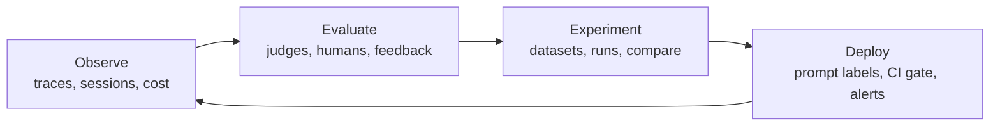
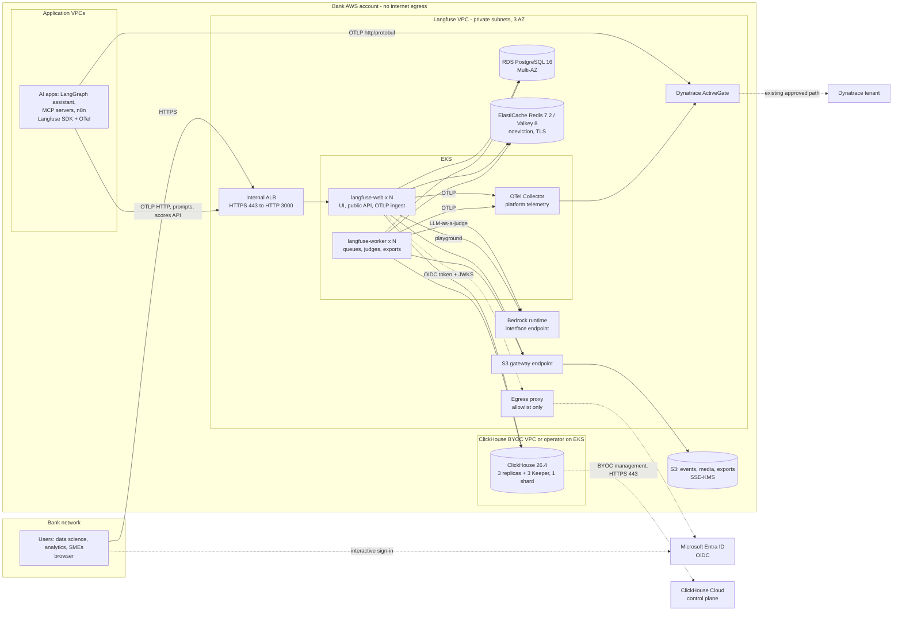

# Architecture (Module M0)

**What this covers:** the Langfuse data model, the AI-engineering loop, the three enterprise deployment models, and an AWS reference architecture for a VPC with no internet egress. It ends with a table mapping each demo component to its production equivalent.
**Capability IDs:** OBS-01..06, EVA-01..07, EXP-01..06 (context), ENT-01..04 (where they land in the architecture), GATE-03 (architectural integration).

Facts were checked against the Langfuse docs on 2026-10-07. The demo pins self-hosted Langfuse **v4.53.0** (`../docker-compose.yml`). Self-hosted v4 has been GA since 2026-07-29, and v3 gets security patches until 2027-01-31 ([upgrade guide](https://langfuse.com/self-hosting/upgrade/upgrade-guides/upgrade-v3-to-v4)).

---

## 1. Data model

Langfuse v4 is **observations-first**. All data lives in one wide observations table, and each row carries the trace-level attributes (user, session, tags, release, environment). A trace is the set of observations that share a `trace_id`, and the **root observation** stands for the trace. Put a turn's overall input/output on that root observation ([data model](https://langfuse.com/docs/observability/data-model)).

Because the attributes live on every row, they must cross process boundaries along with the span context. The agent sends the MCP server W3C `traceparent` **and** `baggage` (`../northwind/config.py`, `inject_trace_context`). The baggage carries the session, user, trace name, version and environment, plus the SDK's claim that the trace already has a root. With `traceparent` alone, the server's first span became a second root of the trace, with its own trace name, no session and `environment=production` even inside experiments. Tags stay out of the baggage: a list does not survive it.

| Entity | What it is | Stored in | In the Northwind demo |
|---|---|---|---|
| **Trace** | One request or operation, e.g. one assistant turn. All observations with the same `trace_id` | ClickHouse | One customer turn, chat or voice |
| **Observation** | One step: nested, typed, timed. Carries I/O, metadata, model, usage, cost | ClickHouse (`events_full` / `events_core` in v4) | LangGraph nodes, LLM calls, MCP tool calls, retrieval |
| **Session** | Groups the traces of one interaction (`session_id`) | Attribute on every observation | One conversation or one phone call |
| **User** | End-user identifier (`user_id`) | Attribute on every observation | Pseudonymous customer handle, never a name or email (see `../northwind/masking.py`) |
| **Environment** | Deployment context. Must match `^(?!langfuse)[a-z0-9-_]+$`, at most 40 chars ([docs](https://langfuse.com/docs/observability/features/environments)) | Attribute | `LANGFUSE_TRACING_ENVIRONMENT=production` (`../.env.example`) |
| **Tags, metadata, release, version** | Low-cardinality labels, key/value context, app release | Attributes | `channel:voice`, release `assistant-1.4.0` (`../northwind/config.py`) |
| **Score** | An evaluation result: numeric, categorical, boolean or text, with source `API`, `ANNOTATION` or `EVAL`. Attaches to a trace, an observation, a session or a dataset run. Its schema is defined by a **score config** | ClickHouse (scores); configs in Postgres | LLM-judge groundedness, thumbs-up/down, SME annotation |
| **Dataset / item / run** | Versioned test cases (input, expected output, metadata). An experiment run executes the app over the items and scores the results | Postgres (datasets, items); ClickHouse (run items, experiment traces) | Golden questions, prompt-injection set (seeders in `../scripts/`) |
| **Prompt / version / label** | Versions are immutable. Labels (`production`, `staging`, `development`, `latest`) point at a version, so the app fetches by label. Protected labels are EE | Postgres | `northwind-assistant-system` v1/v2/v3 (`../northwind/prompts.py`) |
| **Media** | Attachments (audio, images, files) uploaded via presigned URL and referenced from an observation | S3 media bucket + Postgres metadata | Voice-channel audio |

### Observation types

Set them with `as_type=` in Python or `asType` in JS. Framework integrations set them automatically ([observation types](https://langfuse.com/docs/observability/features/observation-types)).

| Type | Meaning | Northwind usage |
|---|---|---|
| `agent` | Decides the application flow and uses tools | The LangGraph assistant (`../northwind/agent.py`) |
| `generation` | A model call with prompt, model, token usage and cost | Every LLM call, linked to the prompt version it used |
| `tool` | A single action such as a function or API call | Core-banking MCP tools (`../northwind/mcp_server.py`) |
| `retriever` | A read-only lookup in a vector store, DB or knowledge base | `search_knowledge_base` over the help center (`../northwind/knowledge.py`) |
| `guardrail` | Protects against malicious content or jailbreaks | Input/output checks: PII, prompt injection, out-of-scope |
| `span`, `chain`, `event`, `embedding`, `evaluator` | Generic work, glue steps, point events, embedding calls, in-app evaluators | Framework spans; the wrapper span that becomes the root observation |

### Where each kind of data lives

| Store | Holds | Notes |
|---|---|---|
| PostgreSQL | Users, orgs, projects, API keys (hashed), prompts, datasets, score configs, evaluator configs, audit logs | Transactional. Small but critical. Must run in UTC |
| ClickHouse | Observations, scores, dataset run items | The analytical bulk. Size it for volume × payload × retention. Must run in UTC |
| Redis / Valkey | Ingestion queue (BullMQ), caches (API keys, prompts) | `maxmemory-policy noeviction` is mandatory |
| S3 | Raw ingested events, media, batch exports | Web writes events here first, and the worker loads them into ClickHouse |

---

## 2. The AI-engineering loop



| Stage | Question it answers | Langfuse features | Where in the demo | IDs |
|---|---|---|---|---|
| Observe | What happened, for whom, how fast, at what cost? | Tracing (OTel-native), sessions, users, environments, cost, multi-modal media, MCP tracing, dashboards | `../northwind/config.py`, `agent.py`, `mcp_server.py`, `knowledge.py`; n8n (`../n8n/`) | OBS-01..06 |
| Evaluate | Is it correct, grounded, safe, compliant? | Observation-level LLM-as-a-judge, code evaluators, annotation queues, user feedback, score configs, score analytics (judge-vs-human agreement) | Evaluator and dataset seeders in `../scripts/` | EVA-01..07 |
| Experiment | Is the candidate better than production? | Datasets, experiments via SDK/UI, side-by-side compare | `../northwind/prompts.py` (v2 candidate, v3 regression) | EXP-01..06 |
| Deploy | Ship safely, roll back in seconds | Fetch prompts by label, protected `production` label (EE), prompt webhooks, CI gate (`langfuse/experiment-action`), alerts (v4+) | `../northwind/prompts.py` | EXP-04, EXP-05 |

Rollback means moving the `production` label back to the previous version. SDK clients pick up the change within the prompt cache TTL (60 s by default) with no redeploy.

---

## 3. Enterprise deployment models

| | **A. Langfuse Cloud** | **B. Self-hosted Langfuse + ClickHouse Cloud** | **C. Self-hosted Langfuse + ClickHouse BYOC (bank VPC)** |
|---|---|---|---|
| Langfuse web/worker | Run by Langfuse (multi-tenant; EU/US/JP/HIPAA regions) | Bank EKS | Bank EKS |
| Postgres, Redis, S3 | Langfuse | Bank (RDS, ElastiCache, S3) | Bank (RDS, ElastiCache, S3) |
| ClickHouse (trace data) | Langfuse | ClickHouse Cloud, outside the bank's account; private connectivity via [PrivateLink](https://clickhouse.com/docs/en/cloud/security/private-link-overview) | **Bank's own AWS account.** BYOC data plane: clusters, data and backups ([BYOC](https://clickhouse.com/docs/cloud/reference/byoc/overview)) |
| Trace data leaves the bank account? | Yes | Yes (to ClickHouse Cloud) | No. Only management traffic and bounded operational telemetry go to the ClickHouse control plane |
| Who operates ClickHouse | Langfuse | ClickHouse | ClickHouse (control plane), running on bank infrastructure |
| Egress needed | App → Langfuse Cloud (HTTPS) | PrivateLink to ClickHouse Cloud | BYOC management channel (HTTPS 443, outbound). Get the destination list from ClickHouse for the firewall |
| Best for | Fastest start; teams without residency constraints | Residency of the app tier; managed analytics | **Strict residency and no-egress VPCs. The recommended POC target** |

Notes:
- Self-hosted Enterprise is sold **bundled with a ClickHouse commercial plan**: ClickHouse Cloud, BYOC, or ClickHouse Private ([self-hosted pricing](https://langfuse.com/pricing-self-host)). Langfuse also documents a self-managed cluster on the [ClickHouse Kubernetes Operator](https://langfuse.com/self-hosting/deployment/infrastructure/clickhouse#clickhouse-kubernetes-operator) as officially supported. If the bank wants to self-operate ClickHouse, confirm with the account team which commercial model covers it.
- ClickHouse Cloud and BYOC separate storage from compute (SharedMergeTree) and support **compute-compute separation**. Langfuse uses it through `CLICKHOUSE_READ_ONLY_URL`, which moves UI and public-API reads off the ingestion path ([scaling](https://langfuse.com/self-hosting/configuration/scaling#clickhouse-read-only-url)).
- Langfuse supports a **single-shard** ClickHouse only. For multi-TB growth, scale vertically or use Cloud/BYOC.

---

## 4. AWS reference architecture: no internet egress

### Components and minimum versions

| Layer | AWS service | Requirement / setting |
|---|---|---|
| Ingress | **Internal Application Load Balancer** (ACM certificate, TLS 1.2+) | Forwards HTTPS 443 → HTTP **3000** on `langfuse-web`. Health check `/api/public/health`. Set the web container's `KEEP_ALIVE_TIMEOUT` to at least the ALB idle timeout + 5 s ([502/504 FAQ](https://langfuse.com/faq/all/self-hosting-502-504-network-errors)) |
| App tier | **EKS** (Kubernetes ≥ 1.28 if the chart deploys ClickHouse) | `langfuse/langfuse` (web) and `langfuse/langfuse-worker` (worker), each ≥ 2 replicas across 3 AZs. IRSA for S3/KMS/Bedrock. Images mirrored to **ECR** |
| Transactional DB | **RDS PostgreSQL ≥ 15** (16 recommended), Multi-AZ | KMS encryption, UTC, automated backups and PITR |
| Queue / cache | **ElastiCache Redis OSS ≥ 7** (7.2 recommended) **or Valkey ≥ 8** | Parameter group `maxmemory-policy noeviction`, TLS, AUTH, replica and automatic failover (or cluster mode) ([cache](https://langfuse.com/self-hosting/deployment/infrastructure/cache)) |
| Object storage | **S3** via **VPC gateway endpoint** | Buckets or prefixes for **events**, **media**, **exports**. SSE-KMS (`LANGFUSE_S3_*_SSE=aws:kms`) and IAM role access. Lifecycle rule on the events bucket only ([blob storage](https://langfuse.com/self-hosting/deployment/infrastructure/blobstorage)) |
| Analytics DB | **ClickHouse BYOC** in a bank-owned VPC, **or** self-managed with the ClickHouse operator: **3 replicas + 3 Keeper, single shard** | **≥ 25.12; 26.4 recommended** (v4 needs lightweight updates, the JSON type and full-text search). UTC. Apply the v4 [grants](https://langfuse.com/self-hosting/deployment/infrastructure/clickhouse#user-permissions) |
| LLM for judges + playground | **Amazon Bedrock** via a **PrivateLink interface endpoint** (`bedrock-runtime`), **or** an internal OpenAI-compatible gateway | Worker calls it for LLM-as-a-judge, web for the playground. An internal gateway hostname must be allowlisted: `LANGFUSE_LLM_CONNECTION_WHITELISTED_HOST` ([LLM connections](https://langfuse.com/docs/administration/llm-connection)). **UNVERIFIED:** whether the Bedrock connection can use the pod's IAM role instead of static keys, and whether a private-DNS Bedrock endpoint trips the SSRF check (if it does, allowlist the `bedrock-runtime` host). Test both in week 1 |
| Identity | **Microsoft Entra ID** over OIDC | Browser sign-in redirects to Entra. The token/JWKS exchange is **server-side from langfuse-web**: route it through the egress proxy (`AUTH_HTTPS_PROXY`). See [ENTERPRISE_SECURITY.md](ENTERPRISE_SECURITY.md) |
| APM | **Dynatrace ActiveGate** inside the VPC | Apps and the Langfuse platform send OTLP to the ActiveGate. Only the ActiveGate talks to the Dynatrace tenant, over the bank's existing approved path. See [DYNATRACE.md](DYNATRACE.md) |

**Load balancer note (for teams used to vendors that require an NLB):** Langfuse web is a plain, stateless HTTP service on port 3000 (`PORT`). It needs no TCP passthrough, sticky sessions, gRPC or WebSockets. OTLP ingestion is HTTP/JSON or HTTP/protobuf on `/api/public/otel` ([OTel](https://langfuse.com/integrations/native/opentelemetry)). An **ALB or any Kubernetes ingress works**, with TLS terminated at the ALB. Langfuse's networking page describes a load balancer in front for exposure and TLS termination and loosely calls it a "network load balancer". That wording describes the usual setup; it is not a requirement for L4 ([networking](https://langfuse.com/self-hosting/security/networking)). Only web is exposed. **Worker, Postgres, Redis, ClickHouse and S3 are internal-only**, reachable from the EKS node and pod security groups and from nothing else.

### Diagram (mermaid)



### Diagram (ASCII fallback)

```
 Bank network                        Bank AWS account (no internet egress)
 +-----------+   HTTPS 443   +---------------------------------------------------------------+
 |  Users    |-------------->| Internal ALB (TLS) --HTTP 3000--> EKS                          |
 | (browser) |               |                                  +------------------------+   |
 +-----------+               |  AI apps (EKS/ECS) --OTLP------->| langfuse-web   x N     |   |
       |                     |   LangGraph, MCP, n8n            | langfuse-worker x N    |   |
       | sign-in             |        |                         | otel-collector         |   |
       v                     |        | OTLP (no payloads)      +---+----+----+----+-----+   |
 +-------------+  token/JWKS |        v                             |    |    |    |         |
 | Entra ID    |<--- egress <--  Dynatrace ActiveGate <----OTLP-----+    |    |    |         |
 | (OIDC)      |     proxy   |        |                                  |    |    |         |
 +-------------+             |        +--> Dynatrace tenant (existing    |    |    |         |
                             |             approved path)                |    |    |         |
                             |   RDS PostgreSQL 16 (Multi-AZ) <----------+    |    |         |
                             |   ElastiCache Redis/Valkey (noeviction) <------+    |         |
                             |   S3 events|media|exports (gateway endpoint) <-----+         |
                             |   Bedrock runtime (PrivateLink) <-- worker (judges)          |
                             |   ClickHouse BYOC: 3 replicas + 3 Keeper, 1 shard <-- web/wkr|
                             |        |                                                      |
                             +--------|------------------------------------------------------+
                                      +--> ClickHouse Cloud control plane (management only)
```

### Network flows

| From | To | Port / protocol | Purpose |
|---|---|---|---|
| Users, apps | Internal ALB | 443 HTTPS | UI, public API, OTLP ingestion, prompt fetch |
| ALB | langfuse-web | 3000 HTTP | Only exposed container |
| web, worker | RDS | 5432 TLS | Transactional data |
| web, worker | ElastiCache | 6379 TLS | Queue and cache |
| web, worker | ClickHouse | 8443 HTTPS, 9440 native TLS (migrations) | Analytics reads/writes (`CLICKHOUSE_URL`, `CLICKHOUSE_MIGRATION_URL`, `CLICKHOUSE_MIGRATION_SSL=true`) |
| web, worker | S3 (gateway endpoint) | 443 | Events, media, exports |
| SDKs, browsers | S3 media / exports | 443 (presigned URLs) | Media upload and playback, export download. See the media note below |
| worker (web for playground) | Bedrock endpoint or gateway | 443 | LLM-as-a-judge, playground |
| web | Entra ID via egress proxy | 443 | OIDC code exchange, JWKS |
| apps, web, worker | ActiveGate | 9999 HTTPS | OTLP to Dynatrace |
| kubelet | worker | 3030 HTTP | Health / liveness |

**Media and presigned URLs.** SDKs and browsers upload and download media directly from S3 using presigned URLs built from `LANGFUSE_S3_MEDIA_UPLOAD_ENDPOINT`; exports use `LANGFUSE_S3_BATCH_EXPORT_EXTERNAL_ENDPOINT`. A gateway endpoint only serves traffic that originates inside the VPC. If analysts play voice recordings from desktops on the corporate network, add an **S3 interface endpoint** reachable from on-prem and point those variables at a hostname that resolves to it. Otherwise audio fails to load in the UI.

### Egress inventory (decisions for infosec)

| Wants to reach | From | What happens if blocked | Recommendation |
|---|---|---|---|
| `eu.posthog.com` (license telemetry, aggregated counts at most every 12 h) | web | The feature is skipped. **With an EE license, telemetry cannot be disabled** ([telemetry](https://langfuse.com/self-hosting/security/telemetry)) | Clarify with Langfuse/ClickHouse before the POC (see [ENTERPRISE_SECURITY.md](ENTERPRISE_SECURITY.md)) |
| `langfuse.com` (update check) | web | Fails gracefully | Block |
| `docker.langfuse.com`, Docker Hub | image pulls | Pull fails | Mirror images into ECR (`docker.io/langfuse/...` works too) |
| Entra ID (`login.microsoftonline.com`) | web | SSO fails | Allow via proxy (`AUTH_HTTPS_PROXY`) |
| ClickHouse control plane | BYOC VPC | BYOC cannot be managed | Allow the ClickHouse-provided destination list only |
| Dynatrace tenant | ActiveGate | No APM data | Existing ActiveGate path |
| `img.shields.io`, `static.langfuse.com` | **user browsers** (not containers) | Badge and onboarding videos don't load | Block. Cosmetic only |

---

## 5. Deploying it

- **Terraform:** the official module [`langfuse/langfuse-terraform-aws`](https://github.com/langfuse/langfuse-terraform-aws) provisions the app tier and data stores and can reuse existing resources ([AWS guide](https://langfuse.com/self-hosting/deployment/aws)). It also disables unused ClickHouse system log tables by default.
- **Helm:** [`langfuse-k8s`](https://github.com/langfuse/langfuse-k8s) ([guide](https://langfuse.com/self-hosting/deployment/kubernetes-helm)). **Chart v2** replaces the Bitnami sub-charts. With `clickhouse.deploy: true` (the default) it renders `ClickHouseCluster` and `KeeperCluster` resources, so the **ClickHouse operator and cert-manager must be installed first**. For this architecture set `postgresql.deploy`, `redis.deploy`, `s3.deploy` and `clickhouse.deploy` to `false` and point at RDS, ElastiCache, S3 and BYOC. External-only releases do not need the operator.
- **Bootstrap:** `LANGFUSE_INIT_*` (headless initialization) creates the first org, project and user, as the demo does. After that, manage orgs and projects through the Org Management API / SCIM (EE).
- **License:** `LANGFUSE_EE_LICENSE_KEY` goes on **both** web and worker ([license key](https://langfuse.com/self-hosting/license-key)).

---

## 6. Demo vs production

The local stack (`../docker-compose.yml`, project `northwind`) mirrors the production topology, with single containers instead of managed services.

| Demo component (compose) | Demo setting | Production equivalent |
|---|---|---|
| `langfuse-web` 4.53.0, port 3100 → 3000 | `NEXTAUTH_URL=http://localhost:3100`, password login | EKS Deployment ≥ 2 replicas behind the internal ALB, HPA. `NEXTAUTH_URL=https://langfuse.<internal-domain>`. Entra ID SSO, password login disabled |
| `langfuse-worker` 4.53.0, 127.0.0.1:13030 | Single replica | EKS Deployment ≥ 2 replicas. Autoscale on CPU or queue depth. Liveness probe `:3030/api/health?failIfQueueConsumptionStuck=true` |
| `postgres:17` container | Local volume, `TZ=UTC` | RDS PostgreSQL 16, Multi-AZ, KMS, PITR, UTC |
| `redis:7` | `--maxmemory-policy noeviction`, password | ElastiCache Redis 7.2 / Valkey 8, noeviction parameter group, TLS, Multi-AZ failover |
| `clickhouse-server:25.12` single container | `CLICKHOUSE_CLUSTER_ENABLED=false` | ClickHouse BYOC, or operator with 3 replicas + 3 Keeper, single shard, 26.4 recommended. TLS URLs (8443 / 9440) |
| `minio` with `events/`, `media/`, `exports/` prefixes in one bucket | Static keys, path-style | S3 buckets or prefixes, SSE-KMS, gateway endpoint, IRSA (no static keys). Lifecycle on events only, never on media |
| `LANGFUSE_S3_BATCH_EXPORT_ENABLED=true` | MinIO presigned URLs | Exports bucket. External endpoint reachable by analyst desktops |
| `LANGFUSE_INIT_*` bootstrap | One org, project `retail-assistant`, one owner | First project only. Then Org Management API / SCIM. One project per application |
| `LANGFUSE_EE_LICENSE_KEY` read by `../scripts/up.sh` from the repo-root `.env` | Never copied into demo files | AWS Secrets Manager → External Secrets, on web **and** worker |
| `SALT`, `NEXTAUTH_SECRET`, `ENCRYPTION_KEY`, DB passwords in `.env` | Demo values | Generated, stored in Secrets Manager, rotated. `ENCRYPTION_KEY` = 64 hex chars (`openssl rand -hex 32`) |
| `TELEMETRY_ENABLED=false` | Intended as "no call-home" | **Has no effect with an EE license**, which always reports aggregated telemetry. Handle it in the egress decision |
| `AUTH_AZURE_AD_*` (commented out) | Off | Enabled (see [ENTERPRISE_SECURITY.md](ENTERPRISE_SECURITY.md)). Note the linking variable is `AUTH_AZURE_AD_ALLOW_ACCOUNT_LINKING` |
| `jaeger` 2.22.0 (UI :16686, OTLP :14318) | APM stand-in | Dynatrace via an ActiveGate in the VPC (see [DYNATRACE.md](DYNATRACE.md)) |
| `n8n` (`latest`) | Low-code workflows, diagnostics off | The bank's n8n deployment with a **pinned** version. Langfuse has no native n8n tracing ([n8n](https://langfuse.com/integrations/no-code/n8n)): trace the instrumented services n8n calls, and use the Langfuse n8n prompt node |
| Northwind app (`../northwind/`), run locally | Local Python, keys from `.env` | Container on EKS. Keys from Secrets Manager. One shared TracerProvider exporting to Langfuse and Dynatrace (`../northwind/config.py`) |
| MCP server (`../northwind/mcp_server.py`, `localhost:8765`) | Streamable HTTP, in-memory data | Internal service behind mTLS / service mesh. Authorization enforced server-side. Trace context passed in MCP `_meta` |
| Stateful ports bound to `127.0.0.1` | Local isolation | Security groups: no route from outside the EKS node/pod SGs |
| Model calls to Anthropic/OpenAI over the internet | API keys in `.env` | Bedrock via PrivateLink, or the bank's internal gateway. No internet route |
