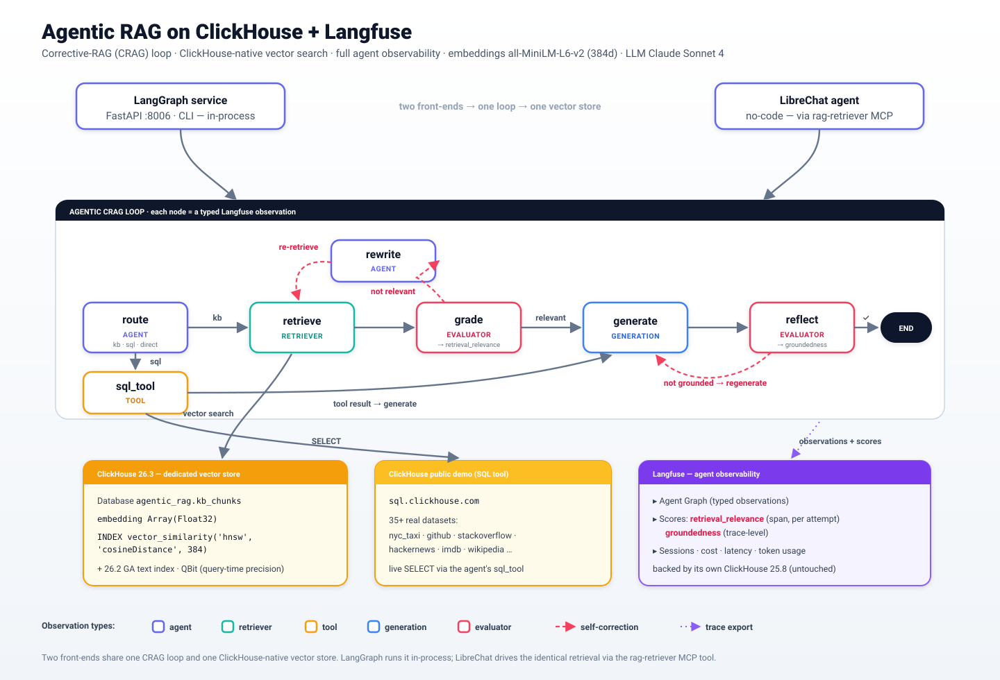

# Agentic RAG — Architecture

A corrective-RAG (CRAG) agent over a **ClickHouse-native vector store**, fully
observable in **Langfuse**. Two front-ends drive the *same* retrieval logic:
a code-first **LangGraph** service and a no-code **LibreChat** agent.



> Diagram source: [`agentic-rag-architecture.svg`](agentic-rag-architecture.svg) · PNG export: [`agentic-rag-architecture.png`](agentic-rag-architecture.png) (2000px, for slides)

## System diagram

```
                                  ENTRY POINTS
   ┌───────────────────────────────────┐     ┌──────────────────────────────────┐
   │  LangGraph service  (agentic-rag)  │     │  LibreChat "Agentic RAG Assistant"│
   │  FastAPI :8006  +  CLI             │     │  (no-code, MCP tool-calling)      │
   │  POST /query {question}            │     │  http://localhost:3080            │
   └───────────────┬────────────────────┘     └─────────────────┬─────────────────┘
                   │ in-process                                  │ MCP (SSE)
                   │ (clickhouse_store)                          ▼
                   │                              ┌────────────────────────────────┐
                   │                              │ mcp-rag-retriever  :8007         │
                   │                              │ tools: retrieve_kb,              │
                   │                              │        list_documents            │
                   │                              └─────────────────┬────────────────┘
                   │                                                │
   ════════════════╪════════════════  CRAG AGENT LOOP  ════════════╪═══════════════
                   ▼                                                │
        ┌───────────────────┐                                       │
        │  route (agent)    │ kb / sql / direct                     │
        └───┬───────┬───────┘                                       │
       sql  │   kb  │  direct                                       │
   ┌────────▼──┐ ┌──▼──────────┐                                    │
   │ sql_tool  │ │  retrieve   │◄───────────────────────────────────┘
   │ (tool)    │ │ (retriever) │──┐  ClickHouse native vector search
   └────┬──────┘ └──┬──────────┘  │
        │           ▼             │
        │        ┌─────────┐  not relevant   ┌──────────────┐
        │        │ grade   │────────────────►│ rewrite      │
        │        │(evaluator)│  (≤2 tries)   │ (agent)      │
        │        └──┬──────┘◄─────────────────┴──────────────┘
        │  relevant │
        ▼           ▼
        ┌────────────────────┐     not grounded (≤1 retry)   ┌──────────────────┐
        │  generate          │◄──────────────────────────────│ reflect          │
        │  (generation)      │───────────────────────────────►│ (evaluator)      │
        └────────────────────┘                                └────────┬─────────┘
                                                          grounded ✔    ▼  score: groundedness
                                                                       END
   ════════════════════════════════════════════════════════════════════════════════

                              DATA + STORAGE LAYER
   ┌────────────────────────────────────┐   ┌───────────────────────────────────┐
   │ clickhouse-vectors  (26.3)  :8125   │   │ ClickHouse public demo            │
   │ DB agentic_rag.kb_chunks            │   │ sql.clickhouse.com (SQL tool)     │
   │  • embedding Array(Float32)         │   │  nyc_taxi, github, stackoverflow… │
   │  • INDEX vector_similarity(         │   └───────────────────────────────────┘
   │      'hnsw','cosineDistance',384)   │
   │  • (text index + QBit available)    │   embeddings: all-MiniLM-L6-v2 (384d)
   └────────────────────────────────────┘   LLM: Claude Sonnet 4

                              OBSERVABILITY LAYER
   Every node emits a typed Langfuse observation:
     route→agent · retrieve→retriever · sql_tool→tool · grade/reflect→evaluator · generate→generation
   Evaluator scores: retrieval_relevance (span-level, per grade — shows self-correction) · groundedness (trace-level)
   ┌───────────────────────────────────────────────────────────────────────────┐
   │ Langfuse (:3001)  ──►  Agent Graph · Sessions · Online LLM-as-judge ·        │
   │                        Datasets/Experiments · Prompt mgmt                    │
   │ backed by its own ClickHouse 25.8 (untouched)                                │
   └───────────────────────────────────────────────────────────────────────────┘
```

## Why two ClickHouse instances

| Instance | Version | Role |
|---|---|---|
| `langfuse-clickhouse` | 25.8 (pinned by Langfuse) | Langfuse's trace/observability OLAP backend — left untouched |
| `clickhouse-vectors` | **26.3** (latest stable) | RAG vector store — needs the GA `vector_similarity` index + 26.2 `text` index + `QBit` |

Decoupling means the demo runs the **latest** ClickHouse vector features without
waiting for Langfuse to bump its supported version.

## Agentic patterns shown (vs. the naive `vector-rag` demo)

| Pattern | Naive `vector-rag` | Agentic RAG |
|---|---|---|
| Retrieval | single-shot top-k (ChromaDB) | **ClickHouse HNSW**, graded, re-retrieved |
| Routing | none | KB vs live-SQL vs direct |
| Self-correction | none | query rewrite + re-retrieve (≤2) |
| Tool use | none | ClickHouse SQL tool |
| Reflection | none | groundedness self-check (≤1 regen) + score |
| Langfuse view | flat spans | **Agent Graph** + typed observations |

## Native capabilities now used (previously not)

- **ClickHouse**: native `vector_similarity` HNSW index (replaces ChromaDB),
  metadata/hybrid filtering, 26.2 GA `text` index, `QBit` query-time precision.
- **Langfuse**: Agent Graph, typed observations (`agent`/`retriever`/`tool`/`evaluator`),
  sessions, online LLM-as-judge, dataset experiments (naive vs agentic).
```
