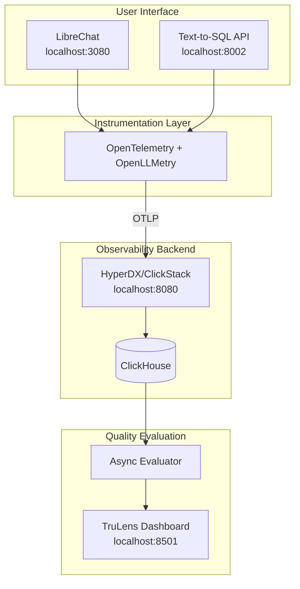

# Quickstart Guide

Get the LLM Observability demo running end-to-end in 15-30 minutes.

---

## What You'll Build

A complete LLM observability pipeline with:
- **LibreChat** - Chat interface for interacting with LLMs
- **HyperDX/ClickStack** - Trace visualization and dashboards
- **Text-to-SQL Demo** - LLM app with automatic instrumentation
- **TruLens** - LLM quality evaluation (async)

```
ASCII Architecture:

┌─────────────────────────────────────────────────────────────────┐
│                        USER INTERFACE                           │
│  LibreChat (localhost:3080)    Text-to-SQL API (localhost:8002) │
└────────────────┬────────────────────────────┬───────────────────┘
                 │                            │
                 ▼                            ▼
┌─────────────────────────────────────────────────────────────────┐
│                     INSTRUMENTATION LAYER                       │
│           OpenTelemetry + OpenLLMetry (automatic tracing)       │
└────────────────────────────────┬────────────────────────────────┘
                                 │ OTLP
                                 ▼
┌─────────────────────────────────────────────────────────────────┐
│                    OBSERVABILITY BACKEND                        │
│  HyperDX/ClickStack (localhost:8080) ─── ClickHouse (storage)   │
└────────────────────────────────┬────────────────────────────────┘
                                 │
                                 ▼
┌─────────────────────────────────────────────────────────────────┐
│                    QUALITY EVALUATION                           │
│     TruLens Dashboard (localhost:8501) ─── Async Evaluator      │
└─────────────────────────────────────────────────────────────────┘
```



---

## Prerequisites

| Requirement | Version | Check Command |
|-------------|---------|---------------|
| Docker | 20.10+ | `docker --version` |
| Docker Compose | 2.0+ | `docker compose version` |
| Anthropic API Key | - | [Get one here](https://console.anthropic.com/) |

**Hardware:** 8GB RAM minimum (16GB recommended for full stack)

---

## Step 1: Clone and Configure (5 minutes)

### 1.1 Clone the Repository

```bash
git clone https://github.com/your-org/clickhouse-llm-observability.git
cd clickhouse-llm-observability
```

### 1.2 Start ClickStack (Observability Backend)

ClickStack runs separately to receive traces from all services:

```bash
# Start ClickStack
docker run -d --name clickstack \
  -p 8080:8080 -p 4317:4317 -p 4318:4318 \
  docker.hyperdx.io/hyperdx/hyperdx-all-in-one

# Wait for it to be ready (usually 30-60 seconds)
echo "Waiting for ClickStack to start..."
until curl -s http://localhost:8080 > /dev/null 2>&1; do
  sleep 2
  echo -n "."
done
echo " Ready!"
```

### 1.3 Get Your ClickStack API Key

1. Open http://localhost:8080
2. Create an account (any email/password for local use)
3. Go to **Team Settings** (gear icon in sidebar)
4. Copy the **Ingestion API Key**

### 1.4 Configure Environment

```bash
# Copy the example environment file
cp .env.example .env
```

Edit `.env` and set these **required** values:

```bash
# Required - your API keys
ANTHROPIC_API_KEY=sk-ant-api03-xxxxx     # From console.anthropic.com
CLICKSTACK_API_KEY=xxxxx                  # From step 1.3

# Required for LibreChat - generate with: openssl rand -hex 32
CREDS_KEY=<generate-32-hex-bytes>
CREDS_IV=<generate-32-hex-bytes>
JWT_SECRET=<generate-32-hex-bytes>
JWT_REFRESH_SECRET=<generate-32-hex-bytes>
```

Quick way to generate all secrets:

```bash
# Generate and append secrets to .env
echo "" >> .env
echo "# Generated secrets" >> .env
echo "CREDS_KEY=$(openssl rand -hex 32)" >> .env
echo "CREDS_IV=$(openssl rand -hex 16)" >> .env
echo "JWT_SECRET=$(openssl rand -hex 32)" >> .env
echo "JWT_REFRESH_SECRET=$(openssl rand -hex 32)" >> .env
```

---

## Step 2: Start the Services (5 minutes)

### 2.1 Connect ClickStack to Docker Network

```bash
# Create the network if it doesn't exist
docker network create clickhouse-llm-observability_default 2>/dev/null || true

# Connect ClickStack to the compose network
docker network connect clickhouse-llm-observability_default clickstack
```

### 2.2 Build and Start All Services

```bash
# Build and start (this takes 3-5 minutes first time)
docker compose up -d --build
```

### 2.3 Verify Services Are Running

```bash
docker compose ps
```

Expected output (all should be "running" or "Up"):

```
NAME                         STATUS
librechat-api                Up
librechat-mongodb            Up
librechat-meilisearch        Up
librechat-nginx              Up
librechat-otelcol            Up
librechat-exporter-watcher   Up
mcp-clickhouse               Up
text-to-sql                  Up
trulens-dashboard            Up
```

---

## Step 3: Verify Everything Works (5 minutes)

### 3.1 Service URLs

| Service | URL | What It Does |
|---------|-----|--------------|
| **LibreChat** | http://localhost:3080 | Chat interface |
| **HyperDX** | http://localhost:8080 | Trace visualization |
| **Text-to-SQL API** | http://localhost:8002 | Demo API endpoint |
| **TruLens Dashboard** | http://localhost:8501 | Quality scores |

### 3.2 Quick Health Check

```bash
# Check all services are responding
echo "Checking LibreChat..."    && curl -s -o /dev/null -w "%{http_code}" http://localhost:3080 && echo " OK"
echo "Checking HyperDX..."      && curl -s -o /dev/null -w "%{http_code}" http://localhost:8080 && echo " OK"
echo "Checking Text-to-SQL..."  && curl -s -o /dev/null -w "%{http_code}" http://localhost:8002/health && echo " OK"
echo "Checking TruLens..."      && curl -s -o /dev/null -w "%{http_code}" http://localhost:8501 && echo " OK"
```

---

## Step 4: Generate Traces (5 minutes)

### Option A: Use LibreChat (Recommended)

1. Open http://localhost:3080
2. Create an account (registration is enabled by default)
3. Start a new chat with Claude
4. Ask a question like: *"What are the most expensive areas in London for property?"*
5. The conversation will be automatically traced

### Option B: Use the Text-to-SQL API

```bash
# Send a query to the Text-to-SQL demo
curl -X POST http://localhost:8002/query \
  -H "Content-Type: application/json" \
  -d '{"question": "What are the top 5 UK cities by average house price?"}'
```

### Option C: Run Demo Mode

```bash
# Run 3 pre-defined queries with TruLens evaluation
docker compose exec text-to-sql python main.py --demo
```

---

## Step 5: View Traces in HyperDX (5 minutes)

### 5.1 Open HyperDX

1. Go to http://localhost:8080
2. Click **Search** in the sidebar
3. Select **Traces** tab

### 5.2 Find Your Traces

Filter by service name:
- `ServiceName = librechat-api` - LibreChat conversations
- `ServiceName = text-to-sql-demo` - Text-to-SQL queries
- `ServiceName = librechat-conversations` - Exported conversations

### 5.3 What to Look For

Click on any trace to see:

| Attribute | Description | Example |
|-----------|-------------|---------|
| `gen_ai.prompt.0.content` | The prompt sent to the LLM | "What is the weather?" |
| `gen_ai.completion.0.content` | The LLM's response | "I don't have access to..." |
| `gen_ai.usage.input_tokens` | Tokens in the prompt | 150 |
| `gen_ai.usage.output_tokens` | Tokens in the response | 89 |
| `gen_ai.request.model` | Model used | claude-sonnet-4-20250514 |
| `Duration` | Response latency | 1.2s |

---

## Step 6: Run Quality Evaluation (Optional)

The trace evaluator runs LLM-as-judge evaluation on your traces.

### 6.1 List Available Services

```bash
docker compose run --rm trace-evaluator --list-services
```

### 6.2 Evaluate Recent Traces

```bash
# Evaluate traces from the last hour
docker compose run --rm trace-evaluator --hours 1

# Or evaluate a specific service
docker compose run --rm trace-evaluator --service text-to-sql-demo --hours 1
```

### 6.3 View Results in TruLens Dashboard

1. Open http://localhost:8501
2. See the **Leaderboard** for aggregate scores
3. Click **Records** to see individual evaluations
4. Each record shows:
   - **Answer Relevance** (0-1): Does the response address the question?
   - **Coherence** (0-1): Is the response well-structured?

---

## Success Criteria

You know the demo is working when you can:

- [ ] Access LibreChat at http://localhost:3080 and send a message
- [ ] See traces appear in HyperDX at http://localhost:8080
- [ ] View trace details with `gen_ai.*` attributes
- [ ] (Optional) See evaluation scores in TruLens at http://localhost:8501

---

## Troubleshooting

### Services won't start

```bash
# Check logs for errors
docker compose logs --tail=50

# Check specific service
docker compose logs text-to-sql --tail=50
```

### No traces appearing in HyperDX

```bash
# Verify API key is set
grep CLICKSTACK_API_KEY .env

# Check ClickStack network connectivity
docker compose exec text-to-sql curl -v http://clickstack:4318
```

### LibreChat registration fails

```bash
# Ensure secrets are set in .env
grep -E "CREDS_KEY|JWT_SECRET" .env

# Restart the API
docker compose restart api
```

### TruLens dashboard is empty

The dashboard only shows data after you run an evaluation:

```bash
# Run evaluation to populate the dashboard
docker compose run --rm trace-evaluator --service text-to-sql-demo --hours 24
```

---

## Cleanup

```bash
# Stop all services
docker compose down

# Stop ClickStack
docker stop clickstack && docker rm clickstack

# Remove volumes (deletes all data)
docker compose down -v
docker volume rm $(docker volume ls -q | grep clickhouse-llm-observability)
```

---

## Next Steps

| Goal | Documentation |
|------|---------------|
| Learn how everything works | [Tutorial Guide](./TUTORIAL.md) |
| Understand evaluation architecture | [Evaluation Architecture](./EVALUATION_ARCHITECTURE.md) |
| Test evaluation failure modes | [Evaluation Scenarios](./EVALUATION_SCENARIOS.md) |
| Add Langfuse integration | [Langfuse Integration](./LANGFUSE_INTEGRATION.md) |
| Create custom dashboards | [Dashboard API](./hyperdx-dashboard-api.md) |

---

## Quick Reference

### Commands

```bash
# Start everything
docker compose up -d

# Stop everything
docker compose down

# View logs
docker compose logs -f [service-name]

# Rebuild a service
docker compose build [service-name]

# Run trace evaluator
docker compose run --rm trace-evaluator --help

# Export test scenarios
docker compose run --rm test-scenarios
```

### Ports

| Port | Service |
|------|---------|
| 80 | Nginx (LibreChat proxy) |
| 3080 | LibreChat API |
| 4317 | OTLP gRPC |
| 4318 | OTLP HTTP |
| 8001 | ClickHouse MCP Server |
| 8002 | Text-to-SQL API |
| 8003 | Vector RAG API |
| 8080 | HyperDX/ClickStack |
| 8501 | TruLens Dashboard |

### Environment Variables (Required)

| Variable | Description |
|----------|-------------|
| `ANTHROPIC_API_KEY` | Anthropic API key |
| `CLICKSTACK_API_KEY` | HyperDX ingestion key |
| `CREDS_KEY` | LibreChat encryption key |
| `JWT_SECRET` | LibreChat JWT secret |
