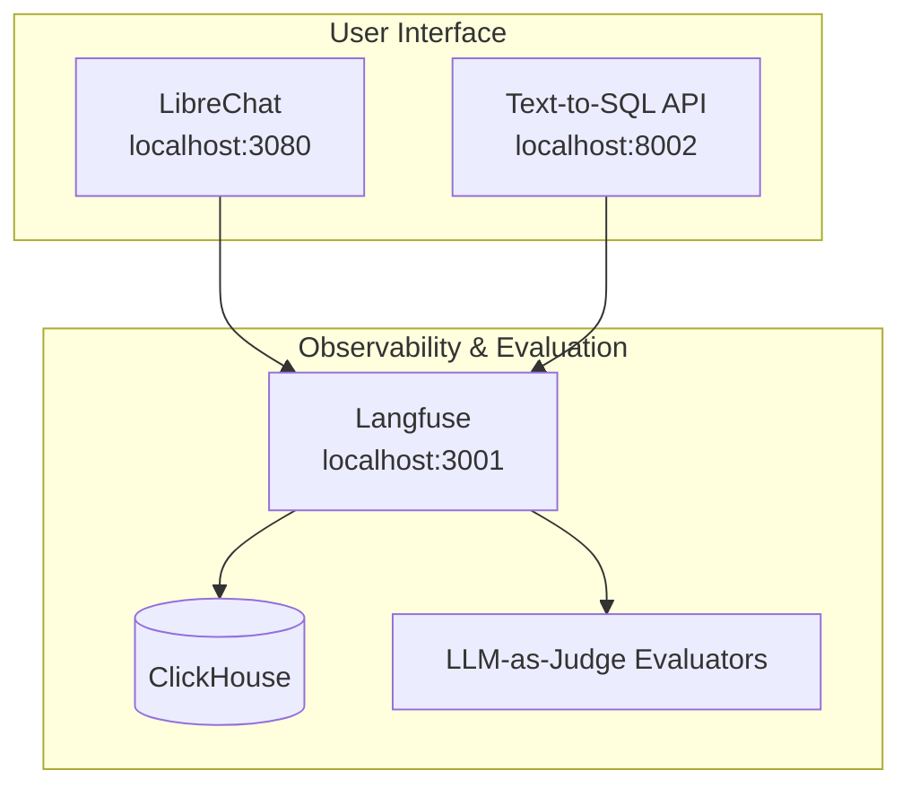

# Quickstart Guide

Get the LLM Observability demo running end-to-end in 15-30 minutes.

---

## Easy Setup (Recommended)

Run everything with a single command:

```bash
git clone https://github.com/your-org/clickhouse-llm-observability.git
cd clickhouse-llm-observability
./setup.sh
```

The setup script will:
1. Check prerequisites (Docker, Docker Compose)
2. Prompt for API keys (Anthropic, Langfuse)
3. Generate all required secrets
4. Build and start all services (including Langfuse)
5. Run the demo and show access URLs

**Other commands:**
```bash
./setup.sh --status    # Show service status and URLs
./setup.sh --cleanup   # Stop and remove all containers
./setup.sh --help      # Show all options
```

If you prefer step-by-step manual setup, continue below.

---

## What You'll Build

A complete LLM observability pipeline with:
- **LibreChat** - Chat interface for interacting with LLMs
- **Langfuse** - LLM observability, trace visualization, and evaluation
- **Text-to-SQL Demo** - LLM app with automatic instrumentation
- **ClickHouse** - Analytics backend for Langfuse

```
ASCII Architecture:

┌─────────────────────────────────────────────────────────────────┐
│                        USER INTERFACE                           │
│  LibreChat (localhost:3080)    Text-to-SQL API (localhost:8002) │
└────────────────┬────────────────────────────┬───────────────────┘
                 │                            │
                 ▼                            ▼
┌─────────────────────────────────────────────────────────────────┐
│                  OBSERVABILITY & EVALUATION                     │
│     Langfuse (localhost:3001) ─── ClickHouse (storage)          │
│     Traces, Scores, LLM-as-Judge Evaluators                     │
└─────────────────────────────────────────────────────────────────┘
```



---

## Prerequisites

| Requirement | Version | Check Command |
|-------------|---------|---------------|
| Docker | 20.10+ | `docker --version` |
| Docker Compose | 2.0+ | `docker compose version` |
| Anthropic API Key | - | [Get one here](https://console.anthropic.com/) |

**Hardware:** 8GB RAM minimum (16GB recommended for full stack)

---

## Step 1: Clone and Configure (5 minutes)

### 1.1 Clone the Repository

```bash
git clone https://github.com/your-org/clickhouse-llm-observability.git
cd clickhouse-llm-observability
```

### 1.2 Configure Environment

```bash
# Copy the example environment file
cp .env.example .env
```

Edit `.env` and set these **required** values:

```bash
# Required - your API key
ANTHROPIC_API_KEY=sk-ant-api03-xxxxx     # From console.anthropic.com

# Required for LibreChat - generate with: openssl rand -hex 32
CREDS_KEY=<generate-32-hex-bytes>
CREDS_IV=<generate-32-hex-bytes>
JWT_SECRET=<generate-32-hex-bytes>
JWT_REFRESH_SECRET=<generate-32-hex-bytes>
```

Quick way to generate all secrets:

```bash
# Generate and append secrets to .env
echo "" >> .env
echo "# Generated secrets" >> .env
echo "CREDS_KEY=$(openssl rand -hex 32)" >> .env
echo "CREDS_IV=$(openssl rand -hex 16)" >> .env
echo "JWT_SECRET=$(openssl rand -hex 32)" >> .env
echo "JWT_REFRESH_SECRET=$(openssl rand -hex 32)" >> .env
```

---

## Step 2: Start the Services (5 minutes)

### 2.1 Build and Start All Services

```bash
# Build and start (this takes 3-5 minutes first time)
docker compose up -d --build
```

### 2.2 Verify Services Are Running

```bash
docker compose ps
```

Expected output (all should be "running" or "Up"):

```
NAME                         STATUS
librechat-api                Up
librechat-mongodb            Up
librechat-meilisearch        Up
librechat-nginx              Up
librechat-otelcol            Up
librechat-exporter-watcher   Up
mcp-clickhouse               Up
text-to-sql                  Up
```

---

## Step 3: Verify Everything Works (5 minutes)

### 3.1 Service URLs

| Service | URL | What It Does |
|---------|-----|--------------|
| **LibreChat** | http://localhost:3080 | Chat interface |
| **Langfuse** | http://localhost:3001 | LLM observability, traces & evaluation |
| **Text-to-SQL API** | http://localhost:8002 | Demo API endpoint |

### 3.2 Quick Health Check

```bash
# Check all services are responding
echo "Checking LibreChat..."    && curl -s -o /dev/null -w "%{http_code}" http://localhost:3080 && echo " OK"
echo "Checking Text-to-SQL..."  && curl -s -o /dev/null -w "%{http_code}" http://localhost:8002/health && echo " OK"
echo "Checking Langfuse..."     && curl -s -o /dev/null -w "%{http_code}" http://localhost:3001 && echo " OK"
```

---

## Step 4: Generate Traces (5 minutes)

### Option A: Use LibreChat (Recommended)

1. Open http://localhost:3080
2. Create an account (registration is enabled by default)
3. Start a new chat with Claude
4. Ask a question like: *"What are the most expensive areas in London for property?"*
5. The conversation will be automatically traced

### Option B: Use the Text-to-SQL API

```bash
# Send a query to the Text-to-SQL demo
curl -X POST http://localhost:8002/query \
  -H "Content-Type: application/json" \
  -d '{"question": "What are the top 5 UK cities by average house price?"}'
```

### Option C: Run Demo Mode

```bash
# Run 3 pre-defined queries with Langfuse tracing
docker compose exec text-to-sql python main.py --demo
```

---

## Step 5: View Traces in Langfuse (5 minutes)

### 5.1 Open Langfuse

1. Go to http://localhost:3001
2. Click **Traces** in the sidebar

### 5.2 Find Your Traces

Browse traces from different sources:
- LibreChat conversations
- Text-to-SQL demo queries
- Vector RAG queries

### 5.3 What to Look For

Click on any trace to see:

| Detail | Description | Example |
|--------|-------------|---------|
| Input | The prompt sent to the LLM | "What is the weather?" |
| Output | The LLM's response | "I don't have access to..." |
| Usage (input tokens) | Tokens in the prompt | 150 |
| Usage (output tokens) | Tokens in the response | 89 |
| Model | Model used | claude-sonnet-4-20250514 |
| Latency | Response time | 1.2s |

---

## Step 6: Run Quality Evaluation (Optional)

The Langfuse evaluator runs LLM-as-judge evaluation on your traces.

### 6.1 Start Langfuse

```bash
docker compose --profile langfuse up -d
```

### 6.2 Configure Native Evaluators

Langfuse provides built-in LLM-as-a-Judge evaluators:

1. Open http://localhost:3001
2. Go to **Evaluations** → **LLM-as-a-Judge**
3. Click **+ New Evaluator**
4. Choose a template (Hallucination, Helpfulness, etc.)
5. Set sampling to 100% for demo
6. Save - evaluators run automatically on new traces

### 6.3 View Results in Langfuse Dashboard

1. Open http://localhost:3001
2. See **Traces** for all traced requests
3. Click any trace to see evaluation scores
4. Scores are automatically added by native evaluators

---

## Success Criteria

You know the demo is working when you can:

- [ ] Access LibreChat at http://localhost:3080 and send a message
- [ ] See traces appear in Langfuse at http://localhost:3001
- [ ] View trace details with prompts, completions, and token usage
- [ ] (Optional) Configure LLM-as-a-Judge evaluators and see evaluation scores

---

## Troubleshooting

### Services won't start

```bash
# Check logs for errors
docker compose logs --tail=50

# Check specific service
docker compose logs text-to-sql --tail=50
```

### No traces appearing in Langfuse

```bash
# Verify Langfuse API keys are set
grep LANGFUSE .env

# Check Langfuse is running
docker compose --profile langfuse ps
```

### LibreChat registration fails

```bash
# Ensure secrets are set in .env
grep -E "CREDS_KEY|JWT_SECRET" .env

# Restart the API
docker compose restart api
```

### Langfuse dashboard is empty

The dashboard only shows data after traces have been generated:

```bash
# Generate traces with the demos
docker compose run --rm text-to-sql python main.py

# Run test scenarios for evaluation data
docker compose --profile tools run --rm test-scenarios
```

---

## Cleanup

```bash
# Stop all services
docker compose down

# Remove volumes (deletes all data)
docker compose down -v
docker volume rm $(docker volume ls -q | grep clickhouse-llm-observability)
```

---

## Next Steps

| Goal | Documentation |
|------|---------------|
| Understand evaluation architecture | [Evaluation Architecture](./EVALUATION_ARCHITECTURE.md) |
| Test evaluation failure modes | [Evaluation Scenarios](./EVALUATION_SCENARIOS.md) |
| Learn about Langfuse | [Langfuse Integration](./LANGFUSE_INTEGRATION.md) |

---

## Quick Reference

### Commands

```bash
# Start everything
docker compose up -d

# Stop everything
docker compose down

# View logs
docker compose logs -f [service-name]

# Rebuild a service
docker compose build [service-name]

# Run test scenarios for evaluation data
docker compose --profile tools run --rm test-scenarios
```

### Ports

| Port | Service |
|------|---------|
| 80 | Nginx (LibreChat proxy) |
| 3080 | LibreChat API |
| 3001 | Langfuse |
| 8001 | ClickHouse MCP Server |
| 8002 | Text-to-SQL API |
| 8003 | Vector RAG API |

### Environment Variables (Required)

| Variable | Description |
|----------|-------------|
| `ANTHROPIC_API_KEY` | Anthropic API key |
| `LANGFUSE_PUBLIC_KEY` | Langfuse public key |
| `LANGFUSE_SECRET_KEY` | Langfuse secret key |
| `CREDS_KEY` | LibreChat encryption key |
| `JWT_SECRET` | LibreChat JWT secret |
