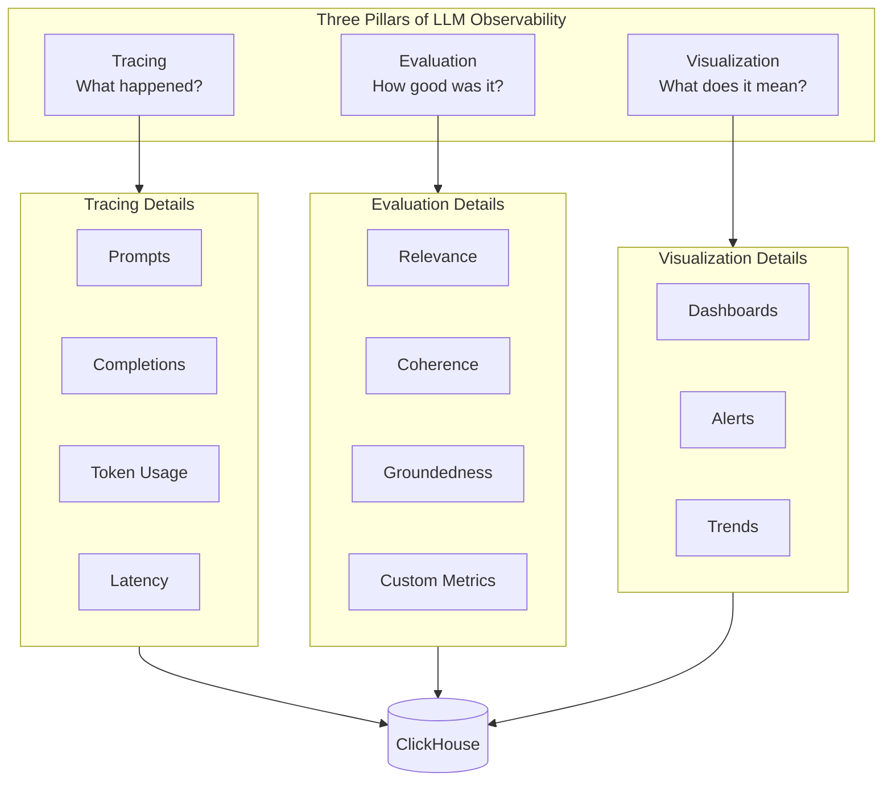
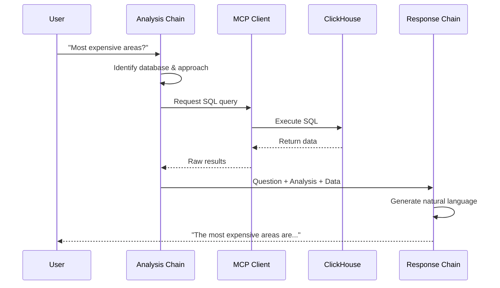

# Tutorial: Building LLM Observability with ClickHouse

A step-by-step guide to understanding and building LLM observability systems. Each part builds on the previous, taking you from concepts to a fully working implementation.

**Estimated Time:** 2-4 hours (can be done in parts)

---

## Table of Contents

1. [Part 1: Understanding the Architecture](#part-1-understanding-the-architecture) (30 min)
2. [Part 2: Building the Tracing Layer](#part-2-building-the-tracing-layer) (45 min)
3. [Part 3: Building an LLM Application](#part-3-building-an-llm-application) (45 min)
4. [Part 4: Adding Quality Evaluation](#part-4-adding-quality-evaluation) (45 min)
5. [Part 5: Visualization & Dashboards](#part-5-visualization--dashboards) (30 min)
6. [Part 6: Advanced Topics](#part-6-advanced-topics) (Optional)

---

## Prerequisites

Before starting this tutorial, ensure you have:

- [ ] Completed the [Quickstart Guide](./QUICKSTART_GUIDE.md) or have services running
- [ ] Basic Python knowledge
- [ ] Familiarity with Docker
- [ ] An Anthropic API key

---

# Part 1: Understanding the Architecture

**Learning Objectives:**
- Understand what LLM observability is and why it matters
- Learn the three pillars: Tracing, Evaluation, Visualization
- Understand how OpenTelemetry fits into the LLM observability stack
- See why ClickHouse is an ideal backend for observability data

## 1.1 What is LLM Observability?

LLM observability is the practice of monitoring, measuring, and understanding LLM-based applications in production. Unlike traditional software, LLMs have unique characteristics that require specialized monitoring:

| Traditional Software | LLM Applications |
|---------------------|------------------|
| Deterministic outputs | Non-deterministic outputs |
| Binary success/failure | Quality is a spectrum |
| Fixed resource usage | Variable token consumption |
| Predictable latency | Highly variable latency |
| Easy to test | Requires semantic evaluation |

### The Three Pillars of LLM Observability

```
ASCII Diagram: Three Pillars

┌─────────────────────────────────────────────────────────────────┐
│                    LLM OBSERVABILITY                            │
├─────────────────┬─────────────────────┬─────────────────────────┤
│                 │                     │                         │
│    TRACING      │    EVALUATION       │    VISUALIZATION        │
│                 │                     │                         │
│  What happened? │  How good was it?   │  What does it mean?     │
│                 │                     │                         │
│  • Prompts      │  • Relevance        │  • Dashboards           │
│  • Completions  │  • Coherence        │  • Alerts               │
│  • Token usage  │  • Groundedness     │  • Trends               │
│  • Latency      │  • Harmlessness     │  • Drill-down           │
│  • Errors       │  • Custom metrics   │  • Reports              │
│                 │                     │                         │
└─────────────────┴─────────────────────┴─────────────────────────┘
         │                   │                     │
         └───────────────────┼─────────────────────┘
                             ▼
                    ┌─────────────────┐
                    │   ClickHouse    │
                    │  (Unified Data  │
                    │    Backend)     │
                    └─────────────────┘
```



### Why These Three Pillars?

1. **Tracing** answers: "What did my LLM application do?"
   - Captures every prompt sent to the LLM
   - Records every response received
   - Tracks token usage for cost calculation
   - Measures latency for performance monitoring

2. **Evaluation** answers: "Was the output good?"
   - Traditional tests can't evaluate LLM quality
   - Uses LLM-as-judge (another LLM evaluates the output)
   - Produces numeric scores for comparison
   - Enables quality regression detection

3. **Visualization** answers: "What patterns do I see?"
   - Aggregates traces across time
   - Shows trends in quality scores
   - Enables drill-down into specific issues
   - Supports alerting on anomalies

## 1.2 OpenTelemetry and OpenLLMetry

### What is OpenTelemetry (OTEL)?

OpenTelemetry is an open standard for observability data. It defines:

- **Traces**: Records of execution paths through a system
- **Spans**: Individual operations within a trace
- **Attributes**: Metadata attached to spans
- **Exporters**: How data is sent to backends

### What is OpenLLMetry?

OpenLLMetry extends OpenTelemetry with LLM-specific conventions:

| Standard OTEL Attribute | OpenLLMetry LLM Attribute |
|------------------------|---------------------------|
| `http.request.body` | `gen_ai.prompt.0.content` |
| `http.response.body` | `gen_ai.completion.0.content` |
| `custom.count` | `gen_ai.usage.input_tokens` |
| `custom.count` | `gen_ai.usage.output_tokens` |
| `service.name` | `gen_ai.request.model` |

This standardization means:
- Any OTEL-compatible backend can store LLM traces
- Tools can understand LLM data without custom parsing
- You can switch between backends without changing code

### The Data Flow

```
ASCII Diagram: Data Flow

┌────────────────────────────────────────────────────────────────┐
│                     YOUR LLM APPLICATION                       │
│                                                                │
│  from traceloop.sdk import Traceloop                           │
│  Traceloop.init(api_key="...", api_endpoint="...")             │
│                                                                │
│  response = llm.invoke("What is the weather?")                 │
│                                                                │
└──────────────────────────┬─────────────────────────────────────┘
                           │
                           │ Automatic instrumentation captures:
                           │ - Prompt content
                           │ - Response content
                           │ - Token counts
                           │ - Latency
                           ▼
┌────────────────────────────────────────────────────────────────┐
│              OPENTELEMETRY COLLECTOR (OTLP)                    │
│                                                                │
│  Receives spans via HTTP (4318) or gRPC (4317)                 │
│  Processes, batches, and forwards to exporters                 │
│                                                                │
└──────────────────────────┬─────────────────────────────────────┘
                           │
                           ▼
┌────────────────────────────────────────────────────────────────┐
│                       CLICKHOUSE                               │
│                                                                │
│  Stores spans in columnar format                               │
│  Enables fast analytical queries                               │
│  Powers dashboards and alerts                                  │
│                                                                │
└────────────────────────────────────────────────────────────────┘
```

## 1.3 Why ClickHouse?

ClickHouse is a column-oriented database designed for analytics. It's ideal for observability because:

| Feature | Benefit for LLM Observability |
|---------|------------------------------|
| Columnar storage | Fast aggregations (avg latency, sum tokens) |
| Compression | Stores billions of traces efficiently |
| Real-time ingestion | See traces as they happen |
| SQL interface | Familiar query language |
| Time-series optimized | Built for time-based queries |

### ClickStack/HyperDX

ClickStack (by HyperDX) is an all-in-one observability platform built on ClickHouse. It provides:

- OTLP endpoint for receiving traces
- Web UI for visualization
- Built-in ClickHouse for storage
- Dashboard and alerting capabilities

## 1.4 Exercise: Explore the Architecture

**Task:** Identify the components in this project that map to each pillar.

Open the `docker-compose.yaml` file and find:

1. **Tracing components:**
   - `otelcol` - OpenTelemetry Collector
   - `text-to-sql` - Instrumented LLM app
   - Where is `Traceloop.init()` called?

2. **Evaluation components:**
   - `trace-evaluator` - Async TruLens evaluator
   - `trulens-dashboard` - Quality score visualization

3. **Visualization components:**
   - Where does HyperDX (ClickStack) fit?
   - What port is the UI on?

**Answers:**
<details>
<summary>Click to reveal</summary>

1. Tracing: `Traceloop.init()` is called in `text-to-sql/instrumentation.py`
2. Evaluation: The trace-evaluator queries ClickHouse and runs TruLens
3. Visualization: HyperDX runs externally on port 8080

</details>

---

# Part 2: Building the Tracing Layer

**Learning Objectives:**
- Understand how OpenTelemetry instrumentation works
- Learn the OpenLLMetry API and conventions
- Implement automatic LLM tracing in Python
- View raw trace data in ClickHouse

## 2.1 OpenTelemetry Basics

### Spans and Traces

A **trace** represents a complete request through your system. It's composed of **spans**, which are individual operations.

```
ASCII Diagram: Trace Structure

Trace ID: abc123
├── Span: user_request (root)
│   ├── Span: analysis_chain
│   │   └── Span: llm.chat.completions (Claude call)
│   │       ├── Attribute: gen_ai.prompt = "Analyze this..."
│   │       ├── Attribute: gen_ai.completion = "This query is about..."
│   │       └── Attribute: gen_ai.usage.input_tokens = 150
│   └── Span: response_chain
│       └── Span: llm.chat.completions (Claude call)
│           ├── Attribute: gen_ai.prompt = "Answer based on..."
│           ├── Attribute: gen_ai.completion = "The average house price..."
│           └── Attribute: gen_ai.usage.output_tokens = 89
```

### Setting Up Instrumentation

The key principle: **Initialize instrumentation BEFORE importing LLM libraries.**

```python
# CORRECT: Initialize first
from instrumentation import setup_instrumentation
setup_instrumentation()

# THEN import LangChain
from langchain_anthropic import ChatAnthropic
```

Why? OpenLLMetry uses monkey-patching to wrap LLM library calls. If you import the libraries first, they won't be instrumented.

## 2.2 The Instrumentation Module

Let's examine the actual instrumentation code in this project.

**File:** `text-to-sql/instrumentation.py`

```python
import os
from traceloop.sdk import Traceloop

def setup_instrumentation():
    """
    Initialize OpenTelemetry with OpenLLMetry for LLM tracing.

    IMPORTANT: Call this BEFORE importing any LLM libraries (LangChain, etc.)
    """
    api_key = os.environ.get("CLICKSTACK_API_KEY", "")
    endpoint = os.environ.get(
        "OTEL_EXPORTER_OTLP_ENDPOINT",
        "http://localhost:4318/v1/traces"
    )

    Traceloop.init(
        api_key=api_key,
        api_endpoint=endpoint,
        disable_batch=False,  # Batch spans for efficiency
    )
```

### What Gets Automatically Traced

OpenLLMetry automatically instruments these libraries:

| Library | Traced Operations |
|---------|------------------|
| LangChain | Chains, agents, retrievers |
| Anthropic SDK | Claude API calls |
| OpenAI SDK | GPT API calls |
| ChromaDB | Vector operations |
| Pinecone | Vector operations |

### Trace Attributes Captured

For each LLM call, these attributes are captured:

```python
{
    "gen_ai.system": "anthropic",
    "gen_ai.request.model": "claude-sonnet-4-20250514",
    "gen_ai.prompt.0.role": "user",
    "gen_ai.prompt.0.content": "What is the weather?",
    "gen_ai.completion.0.role": "assistant",
    "gen_ai.completion.0.content": "I don't have access to...",
    "gen_ai.usage.input_tokens": 15,
    "gen_ai.usage.output_tokens": 42,
    "gen_ai.usage.total_tokens": 57,
}
```

## 2.3 Viewing Raw Traces

### In HyperDX UI

1. Go to http://localhost:8080
2. Navigate to **Search** > **Traces**
3. Click on any trace to see the span tree
4. Click on a span to see attributes

### In ClickHouse Directly

You can query the raw trace data in ClickHouse:

```sql
-- Connect to ClickStack's ClickHouse
-- Host: localhost:8123, User: api, Password: api

-- View recent LLM traces
SELECT
    Timestamp,
    ServiceName,
    SpanName,
    SpanAttributes['gen_ai.request.model'] AS model,
    SpanAttributes['gen_ai.usage.input_tokens'] AS input_tokens,
    SpanAttributes['gen_ai.usage.output_tokens'] AS output_tokens
FROM otel_traces
WHERE SpanAttributes['gen_ai.system'] != ''
ORDER BY Timestamp DESC
LIMIT 10;
```

## 2.4 Exercise: Add Custom Attributes

**Task:** Add a custom attribute to track the "question type" in traces.

1. Open `text-to-sql/sql_pipeline.py`

2. Find the `query` method and add a custom span:

```python
from opentelemetry import trace

tracer = trace.get_tracer(__name__)

def query(self, question: str) -> str:
    with tracer.start_as_current_span("classify_question") as span:
        # Add custom attribute
        if "price" in question.lower():
            span.set_attribute("question.type", "pricing")
        elif "count" in question.lower():
            span.set_attribute("question.type", "counting")
        else:
            span.set_attribute("question.type", "general")

        # Continue with query...
```

3. Rebuild and test:

```bash
docker compose build text-to-sql
docker compose up -d text-to-sql
curl -X POST http://localhost:8002/query \
  -H "Content-Type: application/json" \
  -d '{"question": "What is the average house price in London?"}'
```

4. Find your custom attribute in HyperDX under `question.type`

---

# Part 3: Building an LLM Application

**Learning Objectives:**
- Understand the Text-to-SQL pipeline architecture
- Learn how MCP (Model Context Protocol) connects to ClickHouse
- See how LangChain chains work together
- Build a simple query through the pipeline

## 3.1 The Text-to-SQL Pipeline

This demo converts natural language questions into SQL queries and executes them against ClickHouse.

```
ASCII Diagram: Pipeline Flow

User Question: "What are the most expensive areas in London?"
    │
    ▼
┌─────────────────────────────────────────────────────────────────┐
│                     ANALYSIS CHAIN                              │
│  "Looking at this question, I need to query uk_price_paid..."   │
│  Output: Database identification + approach                     │
└──────────────────────────┬──────────────────────────────────────┘
                           │
                           ▼
┌─────────────────────────────────────────────────────────────────┐
│                     MCP CLIENT                                  │
│  Executes: SELECT district, avg(price) FROM uk_price_paid...    │
│  Returns: Raw data from ClickHouse                              │
└──────────────────────────┬──────────────────────────────────────┘
                           │
                           ▼
┌─────────────────────────────────────────────────────────────────┐
│                     RESPONSE CHAIN                              │
│  "Based on the data, the most expensive areas are..."           │
│  Output: Natural language answer                                │
└──────────────────────────┬──────────────────────────────────────┘
                           │
                           ▼
Final Answer: "The most expensive areas in London are Kensington
and Chelsea with an average price of..."
```



## 3.2 Understanding the Code

### Entry Point: `text-to-sql/main.py`

```python
# 1. Initialize instrumentation FIRST
from instrumentation import setup_instrumentation
setup_instrumentation()

# 2. Then import everything else
from sql_pipeline import ClickHouseSQLPipeline
from trulens_config import create_trulens_app

def main():
    # Create the pipeline
    pipeline = ClickHouseSQLPipeline()

    # Wrap with TruLens for evaluation
    tru_app = create_trulens_app(pipeline)

    # Query with tracing
    with tru_app as recording:
        response = pipeline.query("What are the most expensive areas?")
```

### The Pipeline: `text-to-sql/sql_pipeline.py`

The pipeline has two LangChain chains:

```python
class ClickHouseSQLPipeline:
    def __init__(self):
        # Claude model for analysis
        self.llm = ChatAnthropic(
            model=os.getenv("ANTHROPIC_MODEL", "claude-sonnet-4-20250514")
        )

        # MCP client for ClickHouse
        self.mcp_client = MCPClient()

        # Chain 1: Analyze the question
        self.analysis_chain = self._create_analysis_chain()

        # Chain 2: Generate response
        self.response_chain = self._create_response_chain()

    def query(self, question: str) -> str:
        # Step 1: Analyze what database/tables to use
        analysis = self.analysis_chain.invoke({"question": question})

        # Step 2: Get data from ClickHouse via MCP
        context = self.mcp_client.query(analysis.sql)

        # Step 3: Generate natural language response
        response = self.response_chain.invoke({
            "question": question,
            "analysis": analysis.explanation,
            "context": context
        })

        return response.content
```

### MCP Client: `text-to-sql/mcp_client.py`

MCP (Model Context Protocol) provides a standard interface for LLMs to interact with tools:

```python
class MCPClient:
    def __init__(self):
        self.server_url = os.getenv("MCP_SERVER_URL", "http://localhost:8001/sse")

    async def query(self, sql: str) -> str:
        """Execute SQL query through MCP server."""
        # Send query to MCP server
        # MCP server executes against ClickHouse
        # Returns results
```

The MCP server (`mcp-clickhouse`) connects to ClickHouse's SQL Playground, which has 35+ public datasets including:

- `uk_price_paid` - UK property transactions
- `github_events` - GitHub activity data
- `stackoverflow` - Stack Overflow data

## 3.3 Exercise: Trace a Query End-to-End

**Task:** Follow a query through the entire pipeline.

1. **Send a query:**

```bash
curl -X POST http://localhost:8002/query \
  -H "Content-Type: application/json" \
  -d '{"question": "How many properties were sold in London in 2023?"}'
```

2. **Find the trace in HyperDX:**
   - Go to http://localhost:8080
   - Search for `ServiceName = text-to-sql-demo`
   - Click the most recent trace

3. **Identify these spans:**
   - The root span (user request)
   - The analysis chain span
   - The LLM call for analysis
   - The MCP query span
   - The response chain span
   - The LLM call for response

4. **Answer these questions:**
   - How many tokens did the analysis chain use?
   - How long did the MCP query take?
   - What SQL was generated?

**Hint:** Look for spans named `ChatAnthropic.chat` and attributes like `gen_ai.prompt.0.content`

---

# Part 4: Adding Quality Evaluation

**Learning Objectives:**
- Understand why LLM evaluation is different from traditional testing
- Learn how TruLens evaluation works
- Implement async evaluation with LLM-as-judge
- Interpret evaluation scores

## 4.1 Why Evaluate LLMs?

Traditional software testing uses assertions:

```python
# Traditional test
assert calculate_sum(2, 3) == 5  # Deterministic
```

LLM outputs are non-deterministic and semantic:

```python
# LLM "test" - doesn't work
response = llm("What is 2+2?")
assert response == "4"  # Might return "Four", "2+2=4", "The answer is 4"
```

Instead, we use **LLM-as-judge**: another LLM evaluates the quality of the response.

## 4.2 Evaluation Metrics

This project uses TruLens with two key metrics:

### Answer Relevance (0-1)

"Does the response actually answer the question?"

| Score | Meaning | Example |
|-------|---------|---------|
| 0.9-1.0 | Highly relevant | Question about prices, answer has prices |
| 0.5-0.8 | Partially relevant | Answer addresses topic but misses key points |
| 0.0-0.4 | Not relevant | Answer is off-topic or wrong |

### Coherence (0-1)

"Is the response well-structured and logical?"

| Score | Meaning | Example |
|-------|---------|---------|
| 0.9-1.0 | Highly coherent | Clear structure, logical flow |
| 0.5-0.8 | Somewhat coherent | Some unclear parts |
| 0.0-0.4 | Incoherent | Contradictory, confusing |

## 4.3 Real-time vs Async Evaluation

### Real-time Evaluation

```python
# Real-time: Evaluate immediately
response = llm(question)
score = evaluate(question, response)  # +2-5 seconds latency!
return response  # User waits longer
```

**Problems:**
- Doubles or triples response latency
- Expensive (every request evaluated)
- User experience suffers

### Async Evaluation (Recommended)

```python
# Async: Evaluate later
response = llm(question)
store_trace(question, response)  # Fast!
return response  # User gets fast response

# Later, in background...
traces = query_stored_traces()
for trace in traces:
    score = evaluate(trace)  # User doesn't wait
    store_score(trace.id, score)
```

**Benefits:**
- No impact on user latency
- Can sample (evaluate 5% of traffic)
- Run during off-peak hours
- Batch for efficiency

## 4.4 The Trace Evaluator

This project includes an async evaluator that:

1. Queries traces from ClickHouse
2. Runs TruLens evaluation
3. Stores scores for visualization

**File:** `trace-evaluator/main.py`

```python
def evaluate_traces(hours: int = 24, sample_rate: float = 1.0):
    # 1. Query recent traces from ClickHouse
    traces = clickhouse_client.get_llm_traces(hours=hours)

    # 2. Filter for sampling
    traces = sample(traces, rate=sample_rate)

    # 3. Evaluate each trace
    for trace in traces:
        scores = trulens_evaluator.evaluate(
            question=trace.prompt,
            response=trace.completion
        )

        # 4. Store scores
        trulens_evaluator.store_scores(trace.id, scores)
```

### Running the Evaluator

```bash
# List services with traces
docker compose run --rm trace-evaluator --list-services

# Evaluate last 24 hours
docker compose run --rm trace-evaluator --hours 24

# Evaluate specific service with sampling
docker compose run --rm trace-evaluator \
  --service text-to-sql-demo \
  --sample-rate 0.1 \
  --hours 24
```

## 4.5 TruLens Configuration

**File:** `text-to-sql/trulens_config.py`

```python
from trulens.core import Feedback
from trulens.providers.langchain import LangChain

def create_feedback_functions():
    # Use a smaller model for evaluation (cost-efficient)
    provider = LangChain(
        model=ChatAnthropic(model="claude-3-5-haiku-20241022")
    )

    # Feedback function 1: Answer Relevance
    f_relevance = Feedback(
        provider.relevance_with_cot_reasons,  # Chain-of-thought
        name="Answer Relevance"
    ).on_input_output()

    # Feedback function 2: Coherence
    f_coherence = Feedback(
        provider.coherence_with_cot_reasons,
        name="Coherence"
    ).on_output()

    return [f_relevance, f_coherence]
```

### Chain-of-Thought Reasoning

The `_with_cot_reasons` suffix means the evaluator LLM explains its reasoning:

```json
{
    "score": 0.85,
    "reason": "The response directly addresses the question about property
               prices in London. It provides specific data points and
               references the correct time period. However, it could have
               included more context about market trends."
}
```

This reasoning helps debug why scores are low.

## 4.6 Exercise: Run and Interpret Evaluations

**Task:** Generate data, evaluate it, and interpret the results.

1. **Generate some traces:**

```bash
# Run 5 queries through the Text-to-SQL demo
for q in \
  "What are the most expensive areas in London?" \
  "How many properties were sold in 2023?" \
  "What is the average house price in Manchester?" \
  "Tell me about GitHub" \
  "What programming languages are popular?"; do
  curl -s -X POST http://localhost:8002/query \
    -H "Content-Type: application/json" \
    -d "{\"question\": \"$q\"}" > /dev/null
  echo "Sent: $q"
done
```

2. **Run the evaluator:**

```bash
docker compose run --rm trace-evaluator --service text-to-sql-demo --hours 1
```

3. **View results in TruLens Dashboard:**
   - Open http://localhost:8501
   - Go to **Records** tab
   - Click on each record to see scores and reasoning

4. **Answer these questions:**
   - Which query had the lowest relevance score? Why?
   - Do the coherence scores vary much?
   - Can you identify any patterns in low scores?

---

# Part 5: Visualization & Dashboards

**Learning Objectives:**
- Navigate the HyperDX interface
- Understand key LLM metrics
- Build custom queries and visualizations
- Create actionable dashboards

## 5.1 HyperDX Overview

HyperDX provides several views for observability data:

| View | Purpose | Use For |
|------|---------|---------|
| **Search** | Query traces/logs | Finding specific issues |
| **Dashboards** | Visualizations | Monitoring trends |
| **Alerts** | Notifications | Anomaly detection |
| **Sessions** | User sessions | User experience analysis |

## 5.2 Key LLM Metrics

### Token Usage

```sql
-- Total tokens per service
SELECT
    ServiceName,
    sum(toUInt32OrZero(SpanAttributes['gen_ai.usage.input_tokens'])) as input_tokens,
    sum(toUInt32OrZero(SpanAttributes['gen_ai.usage.output_tokens'])) as output_tokens
FROM otel_traces
WHERE Timestamp > now() - INTERVAL 24 HOUR
GROUP BY ServiceName
```

### Cost Estimation

```sql
-- Estimated cost (Claude pricing)
SELECT
    toStartOfHour(Timestamp) as hour,
    sum(
        toUInt32OrZero(SpanAttributes['gen_ai.usage.input_tokens']) * 0.000003 +
        toUInt32OrZero(SpanAttributes['gen_ai.usage.output_tokens']) * 0.000015
    ) as estimated_cost_usd
FROM otel_traces
WHERE Timestamp > now() - INTERVAL 7 DAY
GROUP BY hour
ORDER BY hour
```

### Latency Percentiles

```sql
-- Response time percentiles
SELECT
    ServiceName,
    quantile(0.50)(Duration/1000000) as p50_ms,
    quantile(0.90)(Duration/1000000) as p90_ms,
    quantile(0.99)(Duration/1000000) as p99_ms
FROM otel_traces
WHERE SpanAttributes['gen_ai.system'] != ''
  AND Timestamp > now() - INTERVAL 24 HOUR
GROUP BY ServiceName
```

### Error Rate

```sql
-- Error rate by service
SELECT
    ServiceName,
    countIf(StatusCode = 'STATUS_CODE_ERROR') as errors,
    count() as total,
    round(errors / total * 100, 2) as error_rate_pct
FROM otel_traces
WHERE Timestamp > now() - INTERVAL 24 HOUR
GROUP BY ServiceName
```

## 5.3 Building Dashboards

### Pre-built Dashboards

This project includes pre-built dashboard definitions in `dashboards/`:

```bash
# List available dashboards
ls dashboards/
# llm-observability-dashboard.json
# usage-management-dashboard.json
# cost-dashboard.json
```

### Creating Custom Dashboards

Use the dashboard creation scripts:

```bash
# Create LLM observability dashboard
python scripts/create-hyperdx-dashboard.py \
  --name "My LLM Dashboard" \
  --api-key $CLICKSTACK_API_KEY
```

### Dashboard Tiles

Common tile types for LLM observability:

| Tile Type | Metric | Purpose |
|-----------|--------|---------|
| Time Series | Token usage over time | Trend analysis |
| Number | Total requests | Volume monitoring |
| Table | Top models by usage | Cost allocation |
| Histogram | Latency distribution | Performance analysis |

## 5.4 Exercise: Create a Cost Dashboard

**Task:** Build a simple cost monitoring dashboard.

1. **Open HyperDX** at http://localhost:8080

2. **Create a new dashboard:**
   - Click **Dashboards** in sidebar
   - Click **New Dashboard**
   - Name it "LLM Cost Monitor"

3. **Add a tile for hourly cost:**
   - Click **Add Chart**
   - Use this query:
   ```
   sum(gen_ai.usage.input_tokens) * 0.000003 +
   sum(gen_ai.usage.output_tokens) * 0.000015
   ```
   - Group by: time (1 hour)
   - Chart type: Line

4. **Add a tile for cost by model:**
   - Add another chart
   - Group by: `gen_ai.request.model`
   - Chart type: Pie

5. **Save and view your dashboard**

---

# Part 6: Advanced Topics

This section covers optional advanced topics for production deployments.

## 6.1 Vector RAG Pipeline

The `vector-rag` demo shows a different pattern: RAG with vector embeddings.

```
ASCII Diagram: Vector RAG

┌──────────────────────────────────────────────────────────────────┐
│                      VECTOR RAG PIPELINE                         │
├──────────────────────────────────────────────────────────────────┤
│                                                                  │
│  1. INDEXING (Offline)                                           │
│  ────────────────────                                            │
│  Documents ──▶ Chunking ──▶ Embeddings ──▶ ChromaDB              │
│              (split text)  (sentence-   (vector store)           │
│                            transformers)                         │
│                                                                  │
│  2. RETRIEVAL (Online)                                           │
│  ─────────────────────                                           │
│  Question ──▶ Embed ──▶ Similarity Search ──▶ Top-K Chunks       │
│                        (cosine distance)                         │
│                                                                  │
│  3. GENERATION (Online)                                          │
│  ──────────────────────                                          │
│  Question + Chunks ──▶ Claude ──▶ Answer                         │
│                     (with context)                               │
│                                                                  │
└──────────────────────────────────────────────────────────────────┘
```

### Key Differences from Text-to-SQL

| Aspect | Text-to-SQL | Vector RAG |
|--------|-------------|------------|
| Data source | SQL database | Document corpus |
| Retrieval | SQL query | Vector similarity |
| Context | Query results | Document chunks |
| Best for | Structured data | Unstructured text |

### Running Vector RAG

```bash
# Start the vector RAG demo
docker compose up -d vector-rag

# Query the API
curl -X POST http://localhost:8003/query \
  -H "Content-Type: application/json" \
  -d '{"question": "What is LLM observability?"}'
```

## 6.2 Langfuse Integration

Langfuse is an alternative to TruLens for LLM observability.

### Enabling Langfuse

```bash
# Start Langfuse services
docker compose --profile langfuse up -d

# Wait for startup (~2 minutes)
# Then access at http://localhost:3001
```

### Dual Instrumentation

This project supports running both TruLens and Langfuse simultaneously:

```python
# In text-to-sql/langfuse_config.py
from langfuse.callback import CallbackHandler

def get_langfuse_handler():
    """Get Langfuse callback handler if keys are configured."""
    if os.getenv("LANGFUSE_PUBLIC_KEY"):
        return CallbackHandler()
    return None

# Usage in pipeline
handler = get_langfuse_handler()
if handler:
    response = chain.invoke({"question": q}, callbacks=[handler])
```

### TruLens vs Langfuse

| Feature | TruLens | Langfuse |
|---------|---------|----------|
| Storage | SQLite (local) | ClickHouse |
| Evaluation | Built-in feedback | Custom scorers |
| UI | Streamlit | Web app |
| Pricing | Open source | Open source + cloud |

## 6.3 Production Considerations

### Sampling Strategy

Don't evaluate every request in production:

```python
# Evaluate 5% of traffic
docker compose run --rm trace-evaluator \
  --sample-rate 0.05 \
  --hours 24
```

### Cost Management

Evaluation has costs too:

| Component | Cost Factor |
|-----------|-------------|
| Application LLM | Main cost driver |
| Evaluation LLM | Use smaller model (Haiku) |
| Storage | Minimal with ClickHouse |

### Alerting

Set up alerts for:
- Token usage spikes (cost)
- Latency increases (performance)
- Error rate increases (reliability)
- Low evaluation scores (quality)

## 6.4 Exercise: Compare Evaluation Platforms

**Task:** Run the same queries through both TruLens and Langfuse.

1. **Ensure Langfuse is running:**

```bash
docker compose --profile langfuse up -d
```

2. **Configure Langfuse API keys:**
   - Open http://localhost:3001
   - Create an account and project
   - Copy API keys to `.env`

3. **Restart text-to-sql to enable dual instrumentation:**

```bash
docker compose up -d text-to-sql
```

4. **Run queries:**

```bash
curl -X POST http://localhost:8002/query \
  -H "Content-Type: application/json" \
  -d '{"question": "What is the average house price in the UK?"}'
```

5. **Compare the traces:**
   - HyperDX: http://localhost:8080
   - Langfuse: http://localhost:3001
   - TruLens: http://localhost:8501

6. **Questions to consider:**
   - What information does each platform show?
   - Which interface do you prefer for debugging?
   - How do the evaluation approaches differ?

---

## Summary

You've now learned:

1. **Architecture** - The three pillars of LLM observability
2. **Tracing** - How OpenTelemetry and OpenLLMetry capture LLM data
3. **Applications** - Building instrumented LLM pipelines
4. **Evaluation** - Async quality scoring with LLM-as-judge
5. **Visualization** - Dashboards and metrics for monitoring
6. **Advanced** - Vector RAG, Langfuse, production patterns

### Next Steps

| Goal | Resource |
|------|----------|
| Deep dive on evaluation | [Evaluation Architecture](./EVALUATION_ARCHITECTURE.md) |
| Test failure modes | [Evaluation Scenarios](./EVALUATION_SCENARIOS.md) |
| Add Langfuse | [Langfuse Integration](./LANGFUSE_INTEGRATION.md) |
| Extend the demo | [Extension Spec](../extension-spec.md) |
| Create dashboards | [Dashboard API](./hyperdx-dashboard-api.md) |

---

## Appendix: File Reference

| File | Purpose |
|------|---------|
| `text-to-sql/main.py` | Application entry point |
| `text-to-sql/instrumentation.py` | OpenTelemetry setup |
| `text-to-sql/sql_pipeline.py` | LangChain pipeline |
| `text-to-sql/trulens_config.py` | TruLens evaluation |
| `text-to-sql/mcp_client.py` | ClickHouse MCP client |
| `trace-evaluator/main.py` | Async evaluation CLI |
| `trace-evaluator/clickhouse_client.py` | Query traces |
| `trace-evaluator/trulens_evaluator.py` | Run evaluations |

---

## Appendix: Glossary

| Term | Definition |
|------|------------|
| **OTEL** | OpenTelemetry - observability standard |
| **OpenLLMetry** | LLM-specific OTEL extensions |
| **Span** | A single operation in a trace |
| **Trace** | End-to-end request path |
| **MCP** | Model Context Protocol - tool interface for LLMs |
| **RAG** | Retrieval-Augmented Generation |
| **LLM-as-judge** | Using an LLM to evaluate another LLM |
| **TruLens** | LLM evaluation framework |
| **Langfuse** | LLM observability platform |
| **ClickStack** | HyperDX's all-in-one observability |
